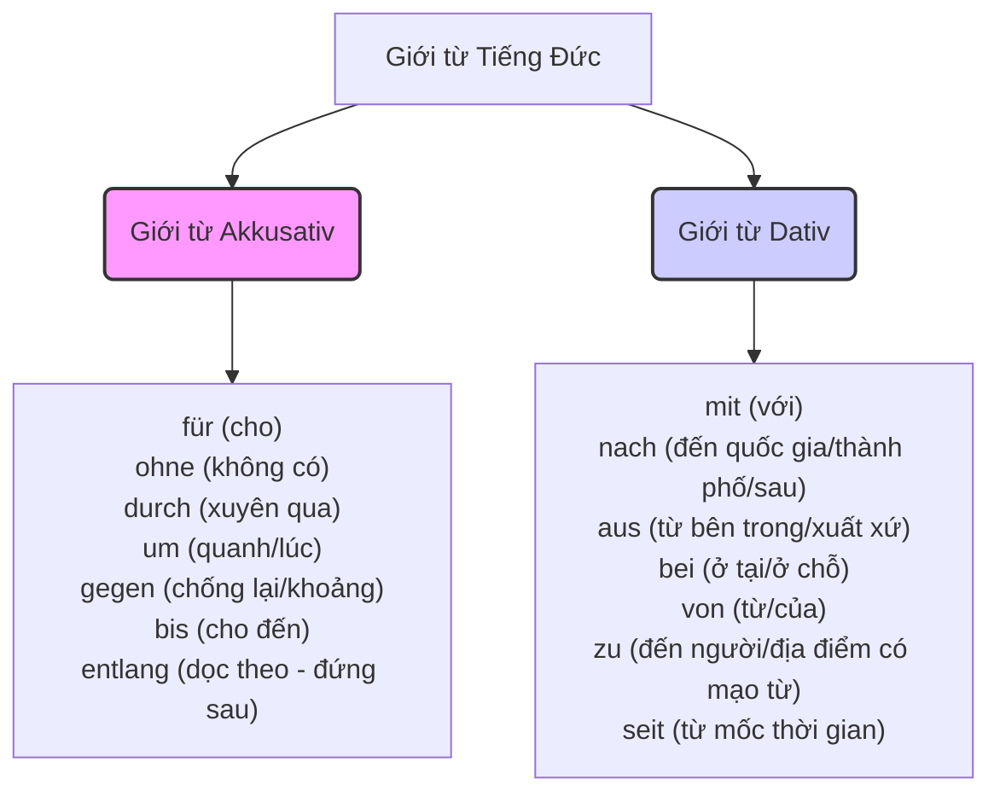

# 16 A1 - Akkusativ und Dativ im Vergleich

> [!INFO] **Tổng quan**
> Trong tiếng Đức, vai trò của danh từ được xác định thông qua 4 Cách (Kasus). Ở trình độ A1, việc phân biệt rõ ràng giữa **Akkusativ (Cách 4 - Tân ngữ trực tiếp)** và **Dativ (Cách 3 - Tân ngữ gián tiếp)** là nền tảng cốt lõi nhất để xây dựng câu chính xác.

---

## 1. So sánh Bản chất: Nominativ vs. Akkusativ vs. Dativ

| Đặc điểm | Nominativ (Cách 1) | Akkusativ (Cách 4) | Dativ (Cách 3) |
| :--- | :--- | :--- | :--- |
| **Vai trò** | **Chủ ngữ** (Chủ thể thực hiện hành động) | **Tân ngữ trực tiếp** (Đối tượng bị tác động) | **Tân ngữ gián tiếp** (Đối tượng nhận/hưởng lợi) |
| **Bản chất** | Ai / Cái gì thực hiện? | Ai / Cái gì bị tác động? | Cho ai? / Với ai? |
| **Từ để hỏi** | **Wer?** (Ai) / **Was?** (Cái gì) | **Wen?** (Ai) / **Was?** (Cái gì) | **Wem?** (Cho ai / Với ai) |
| **Ví dụ** | **Der Vater** gibt... | ...gibt **ein Buch**... | ...gibt **dem Sohn**... |

> [!EXAMPLE] **Ví dụ trực quan trong một câu hoàn chỉnh:**
> *Der Vater (Nom.) gibt dem Sohn (Dat.) ein Buch (Akk.).*
> - **Wer** gibt? $\rightarrow$ *Der Vater* (Chủ ngữ $\rightarrow$ **Nominativ**)
> - **Wem** gibt er? $\rightarrow$ *dem Sohn* (Người nhận $\rightarrow$ **Dativ**)
> - **Was** gibt er? $\rightarrow$ *ein Buch* (Vật được trao $\rightarrow$ **Akkusativ**)

---

## 2. Bảng Tổng hợp Biến cách Mạo từ (Deklination der Artikel)

> [!TIP] **Mẹo nhớ nhanh biến cách:**
> * **Akkusativ:** Nghĩ đến chữ **"ĂN"** $\rightarrow$ Chỉ giống **Đực** đổi đuôi thành **-N** (*den, einen, keinen*), các giống khác giữ nguyên.
> * **Dativ:** Nhớ câu thần chú viết tắt **M - R - M - N** (**"Mẹ Ra Mua Nước"** hoặc **"Mê Răng Móm Nặng"**) tương ứng với đuôi của 4 giống:
>   * **M** (Đực) $\rightarrow$ *de**m** / eine**m** / keine**m***
>   * **R** (Cái) $\rightarrow$ *de**r** / eine**r** / keine**r***
>   * **M** (Trung) $\rightarrow$ *de**m** / eine**m** / keine**m***
>   * **N** (Số nhiều) $\rightarrow$ *de**n** / --- / keine**n*** (+ danh từ thêm **-n** ở cuối)

### 2.1. Bảng Tóm tắt Tổng hợp (Mạo từ Xác định, Không xác định, Phủ định)

| Cách / Giống  | Đực (maskulin - *der*)                                      | Trung (neutral - *das*)                                     | Cái (feminin - *die*)                                       | Số nhiều (Plural - *die*)                                                         |
| :------------ | :---------------------------------------------------------- | :---------------------------------------------------------- | :---------------------------------------------------------- | :-------------------------------------------------------------------------------- |
| **Nominativ** | der / ein / kein                                            | das / ein / kein                                            | die / eine / keine                                          | die / --- / keine                                                                 |
| **Akkusativ** | **den / einen / keinen** | das / ein / kein *(không đổi)*                              | die / eine / keine *(không đổi)*                            | die / --- / keine *(không đổi)*                                                   |
| **Dativ**     | **dem / einem / keinem** | **dem / einem / keinem** | **der / einer / keiner** | **den / --- / keinen** (+ danh từ thêm **-n**) |

### 2.2. Mạo từ Xác định (Bestimmte Artikel)

| Giống danh từ | Nominativ | Akkusativ | Dativ |
| :--- | :--- | :--- | :--- |
| **Đực (der)** | der Mann | **den** Mann | **dem** Mann |
| **Trung (das)** | das Kind | das Kind *(không đổi)* | **dem** Kind |
| **Cái (die)** | die Frau | die Frau *(không đổi)* | **der** Frau |
| **Số nhiều (die Pl.)** | die Kinder | die Kinder *(không đổi)* | **den** Kinder**n** *(thêm -n)* |

### 2.3. Mạo từ Không xác định (Unbestimmte Artikel)

| Giống danh từ | Nominativ | Akkusativ | Dativ |
| :--- | :--- | :--- | :--- |
| **Đực (der)** | ein Mann | **einen** Mann | **einem** Mann |
| **Trung (das)** | ein Kind | ein Kind *(không đổi)* | **einem** Kind |
| **Cái (die)** | eine Frau | eine Frau *(không đổi)* | **einer** Frau |

### 2.4. Mạo từ Phủ định (Negationsartikel)

| Giống danh từ | Nominativ | Akkusativ | Dativ |
| :--- | :--- | :--- | :--- |
| **Đực (der)** | kein Mann | **keinen** Mann | **keinen** Mann |
| **Trung (das)** | kein Kind | kein Kind *(không đổi)* | **keinem** Kind |
| **Cái (die)** | keine Frau | keine Frau *(không đổi)* | **keiner** Frau |
| **Số nhiều (die Pl.)** | keine Kinder | keine Kinder *(không đổi)* | **keinen** Kinder**n** *(thêm -n)* |

---

## 3. Bảng So sánh Đại từ Nhân xưng (Personalpronomen)

| Chủ ngữ (Nominativ) | Tân ngữ trực tiếp (Akkusativ) | Tân ngữ gián tiếp (Dativ) | Nghĩa tiếng Việt (Dativ) | Mẹo nhớ |
| :--- | :--- | :--- | :--- | :--- |
| **ich** | **mich** | **mir** | cho tôi / với tôi | **mi**ch $\rightarrow$ **mi**r |
| **du** | **dich** | **dir** | cho bạn / với bạn | **di**ch $\rightarrow$ **di**r |
| **er** | **ihn** | **ihm** | cho anh ấy | ih**n** $\rightarrow$ ih**m** |
| **sie** *(cô ấy)* | **sie** | **ihr** | cho cô ấy | sie $\rightarrow$ ih**r** |
| **es** | **es** | **ihm** | cho nó | es $\rightarrow$ ih**m** |
| **wir** | **uns** | **uns** | cho chúng tôi | *Không đổi ở Akk & Dat* |
| **ihr** | **euch** | **euch** | cho các bạn | *Không đổi ở Akk & Dat* |
| **sie** *(họ)* | **sie** | **ihnen** | cho họ | sie $\rightarrow$ ih**nen** |
| **Sie** *(lịch sự)* | **Sie** | **Ihnen** | cho Ngài / Quý vị | Sie $\rightarrow$ Ih**nen** |

---

## 4. Phân biệt Động từ: Akkusativ-Verben vs. Dativ-Verben

| Nhóm Động từ đi với **Akkusativ** (Wen/Was?) | Nhóm Động từ đi với **Dativ** (Wem?) |
| :--- | :--- |
| **haben** (có) $\rightarrow$ *Ich habe einen Hund.* **brauchen** (cần) $\rightarrow$ *Ich brauche einen Stift.* **kaufen** (mua) $\rightarrow$ *Er kauft den Tisch.* **suchen** (tìm) $\rightarrow$ *Wir suchen das Hotel.* **finden** (tìm thấy) $\rightarrow$ *Ich finde den Weg không.* **sehen** (nhìn thấy) $\rightarrow$ *Er sieht mich.* **essen / trinken** $\rightarrow$ *Ich esse einen Apfel.* **anrufen** (gọi điện) $\rightarrow$ *Ich rufe dich an.* **lieben** (yêu) $\rightarrow$ *Ich liebe dich.* **es gibt** (có) $\rightarrow$ *Es gibt einen Stuhl.* | **helfen** (giúp đỡ) $\rightarrow$ *Ich helfe dir.* **danken** (cảm ơn) $\rightarrow$ *Ich danke Ihnen.* **antworten** (trả lời) $\rightarrow$ *Er antwortet mir.* **gefallen** (làm ai thích) $\rightarrow$ *Das gefällt mir.* **gehören** (thuộc về) $\rightarrow$ *Das gehört meinem Vater.* **passen** (vừa vặn) $\rightarrow$ *Die Jacke passt mir.* **glauben** (tin) $\rightarrow$ *Ich glaube dir.* **gratulieren** (chúc mừng) $\rightarrow$ *Ich gratuliere dir.* **zuhören** (lắng nghe) $\rightarrow$ *Hör mir zu.* |

---

## 5. Phân biệt Giới từ (Präpositionen)

Giới từ luôn có quyền lực tối cao, ghi nhớ hai nhóm giới từ "bất di bất dịch" sau:

> [!TIP] **Phân biệt nhanh "nach" và "zu" (đều là đi đến):**
> - **nach** + tên thành phố / quốc gia (không mạo từ): *nach Berlin, nach Deutschland* (ngoại lệ: *nach Hause* - đi về nhà).
> - **zu** + người hoặc địa điểm có mạo từ (thường ghép thành **zum** hoặc **zur**): *zum Arzt* (đến bác sĩ), *zur Schule* (đến trường).

---

## 6. Trật tự câu khi có cả 2 Tân ngữ (Satzbau)

Khi câu chứa cả tân ngữ Dativ (chỉ người nhận) và Akkusativ (chỉ vật được trao):

### Quy tắc 1: Nếu cả 2 tân ngữ đều là danh từ
> **Dativ đứng trước, Akkusativ đứng sau.**

* *Ví dụ:* Ich gebe **dem Mann (Dativ)** **den Brief (Akkusativ)**. (Tôi đưa cho người đàn ông bức thư.)

### Quy tắc 2: Nếu xuất hiện đại từ nhân xưng (mich, dich, mir, dir,...)
> **Đại từ luôn được ưu tiên đứng trước danh từ.**

* Nếu Akkusativ là đại từ: **Akkusativ trước, Dativ sau.**
  * *Ví dụ:* Ich gebe **ihn (Akk. đại từ)** **dem Mann (Dativ danh từ)**. (Tôi đưa nó cho người đàn ông.)
* Nếu Dativ là đại từ: **Dativ trước, Akkusativ sau.**
  * *Ví dụ:* Ich gebe **ihm (Dativ đại từ)** **den Brief (Akk. danh từ)**. (Tôi đưa anh ấy bức thư.)
* Nếu cả hai đều là đại từ: **Akkusativ trước, Dativ sau.**
  * *Ví dụ:* Ich gebe **ihn (Akk. đại từ)** **ihm (Dativ đại từ)**. (Tôi đưa nó cho anh ấy.)

---

## 7. Bài tập ôn tập tổng hợp (Có đáp án)

### Bài 1: Chia mạo từ / đại từ trong ngoặc theo đúng cách (Akkusativ / Dativ)
1. Das Geschenk ist für \______ (mein) Bruder. *(der Bruder)*
2. Wir helfen \______ (die) Frau. *(die Frau)*
3. Er kauft \______ (ein) Laptop. *(der Laptop)*
4. Ich gehe mit \______ (du) zum Café.
5. Die Tasche gehört \______ (meine) Mutter. *(die Mutter)*
6. Kannst du \______ (ich) helfen?
7. Es gibt \______ (ein) Tisch im Zimmer. *(der Tisch)*
8. Wir fahren sau \______ (die) Schule nach Hause. *(die Schule)*

<b>👉 Xem đáp án & giải thích bài 1</b>

1. **meinen** (*für* đi với Akkusativ; giống đực *der* $\rightarrow$ *meinen*)
2. **der** (*helfen* đi với Dativ; giống cái *die* $\rightarrow$ *der*)
3. **einen** (*kaufen* đi với Akkusativ; giống đực *der* $\rightarrow$ *einen*)
4. **dir** (*mit* đi với Dativ; đại từ *du* $\rightarrow$ *dir*)
5. **meiner** (*gehören* đi với Dativ; giống cái *die* $\rightarrow$ *meiner*)
6. **mir** (*helfen* đi với Dativ; đại từ *ich* $\rightarrow$ *mir*)
7. **einen** (*es gibt* đi với Akkusativ; giống đực *der* $\rightarrow$ *einen*)
8. **der** (*nach* đi với Dativ; giống cái *die* $\rightarrow$ *der*)

---

### Bài 2: Sửa lỗi sai trong các câu sau
1. Ich danke dich für das Geschenk.
2. Wir gehen durch dem Park.
3. Das ist mein Auto, es gehört mich.
4. Ich gehe nach dem Arzt.
5. Er gibt einen Brief dem Freund.

<b>👉 Xem đáp án & giải thích bài 2</b>

1. ❌ danke dich $\rightarrow$  ✅ **danke dir** (*danken* đi với Dativ).
2. ❌ durch dem Park $\rightarrow$ ✅ **durch den Park** (*durch* đi với Akkusativ; giống đực *der* $\rightarrow$ *den*).
3. ❌ gehört mich $\rightarrow$ ✅ **gehört mir** (*gehören* đi với Dativ; *ich* $\rightarrow$ *mir*).
4. ❌ nach dem Arzt $\rightarrow$ ✅ **zum Arzt** (đi đến người/địa điểm có mạo từ dùng *zu* $\rightarrow$ *zu + dem = zum*).
5. ❌ einen Brief dem Freund $\rightarrow$ ✅ **dem Freund einen Brief** (khi cả 2 tân ngữ là danh từ, Dativ đứng trước Akkusativ).

---

## Các bài viết liên quan trong Vault:
* [[01 A1 - Nomen & Artikel]] — Kiến thức cơ bản về giống và danh từ.
* [[04 A1 - Der Akkusativ]] — Bài viết chi tiết về Akkusativ.
* [[05 A1 - Der Dativ]] — Bài viết chi tiết về Dativ.
* [[03 A1 - Der einfache Satz und die Verbposition]] — Tìm hiểu sâu về cấu trúc câu.
