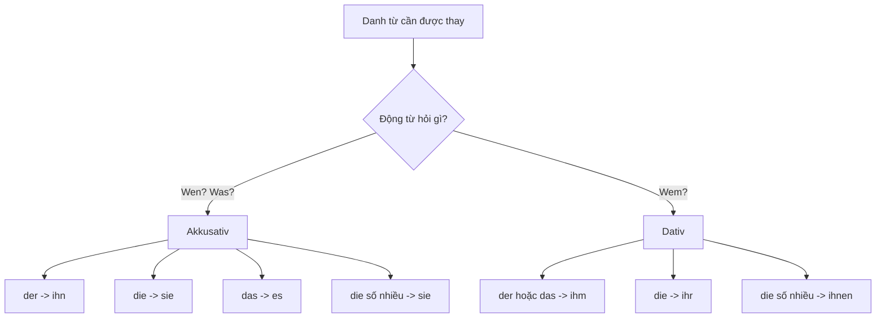

> [!INFO]+ Mục tiêu chương
> Sau bài này, bạn chỉ cần làm được một việc: nhìn vào câu và chọn đúng `ihn`, `ihm`, `sie`, `ihr` hoặc `es`.

---

## 1. Ý chính duy nhất

Khi thay một danh từ bằng đại từ, hãy trả lời **hai câu hỏi theo đúng thứ tự**:

1. **Động từ cần Akkusativ hay Dativ?**
2. **Danh từ gốc là `der`, `die`, `das` hay số nhiều?**

Động từ quyết định **Kasus**. Danh từ quyết định **dạng đại từ**.

> [!TIP] Đừng bắt đầu bằng tiếng Việt “nó là gì?”.
>
> Hãy bắt đầu bằng động từ: động từ đòi **Akkusativ** hay **Dativ**?

## 2. Ví dụ bạn đang gặp: `ihn`

> **Sie braucht den wichtigen Bericht.**
>
> Cô ấy cần bản báo cáo quan trọng.

Làm theo sơ đồ:

1. `brauchen` hỏi **Was?** - Cô ấy cần cái gì? - `den wichtigen Bericht`.
2. `Was?` cho biết đây là **Akkusativ**.
3. Danh từ gốc là `der Bericht` (giống đực).
4. Akkusativ + `der` = **ihn**.

Vì vậy:

> **Sie braucht ihn.**
>
> Cô ấy cần **bản báo cáo đó**.

`ihn` ở đây không có nghĩa riêng là “anh ấy”. Nó thay cho **một danh từ giống đực** đang ở Akkusativ. Vì `der Bericht` là giống đực, ta dùng `ihn` dù báo cáo là đồ vật.

## 3. Đặt Akkusativ và Dativ cạnh nhau

Hãy chỉ nhìn một danh từ giống đực: `der Kollege`.

> **Der Kollege ist nett.** - Đồng nghiệp nam thì tốt bụng.
>
> `er` vì đây là chủ ngữ (Nominativ).

> **Ich sehe den Kollegen.** - Tôi nhìn thấy đồng nghiệp nam.
>
> `sehen` hỏi **Wen?** - Akkusativ - `der` thành **ihn**.
>
> **Ich sehe ihn.**

> **Ich helfe dem Kollegen.** - Tôi giúp đồng nghiệp nam.
>
> `helfen` hỏi **Wem?** - Dativ - `der` thành **ihm**.
>
> **Ich helfe ihm.**

Nhớ theo hàng này:

`er` (chủ ngữ) → `ihn` (Akkusativ) → `ihm` (Dativ)

## 4. Chỉ cần học các dạng ngôi thứ ba trước

Đây là phần quan trọng nhất khi thay đồ vật hoặc người đã được nhắc đến:

| Danh từ gốc | Akkusativ | Dativ |
|---|---|---|
| `der Bericht` | `ihn` | `ihm` |
| `die Tasche` | `sie` | `ihr` |
| `das Buch` | `es` | `ihm` |
| `die Kinder` | `sie` | `ihnen` |

Ví dụ:

- `Ich kaufe den Tisch.` → `Ich kaufe **ihn**.`
- `Ich sehe die Tasche.` → `Ich sehe **sie**.`
- `Ich brauche das Buch.` → `Ich brauche **es**.`
- `Ich helfe der Frau.` → `Ich helfe **ihr**.`

## 5. Vì sao câu có `weil` lại là `weil sie ihn morgen braucht`?

> **Wenn meine nette Kollegin heute keine Zeit hat, schicke ich ihr den wichtigen Bericht, weil sie ihn morgen braucht.**

Chỉ nhìn phần cuối:

`weil` + `sie` + `ihn` + `morgen` + `braucht`

- `weil` = vì, mở mệnh đề phụ (Nebensatz).
- `sie` = cô ấy, chủ ngữ.
- `ihn` = bản báo cáo đó; thay cho `den wichtigen Bericht`.
- `morgen` = ngày mai.
- `braucht` = động từ đã chia; đứng cuối vì sau `weil`.

Nói ngắn gọn: `brauchen` cần Akkusativ, `Bericht` là `der`, nên **ihn**.

> [!WARNING] Không dùng `ihm` trong câu này.
>
> `ihm` là Dativ, nhưng `brauchen` cần Akkusativ.

## 6. Hai nhóm động từ cần nhớ

**Nhóm Akkusativ** - hỏi `Wen? / Was?`

`sehen`, `brauchen`, `haben`, `kaufen`, `finden`, `suchen`, `lieben`

> Ich sehe ihn. / Sie braucht es.

**Nhóm Dativ** - hỏi `Wem?`

`helfen`, `danken`, `gefallen`, `antworten`, `gehören`, `zuhören`

> Ich helfe ihm. / Wir danken ihr.

## 7. Luyện ngay: chỉ đi theo sơ đồ

1. `Ich suche den Schlüssel.` → Ich suche ___.
2. `Wir brauchen das Auto.` → Wir brauchen ___.
3. `Ich helfe der Lehrerin.` → Ich helfe ___.
4. `Das Geschenk gehört den Kindern.` → Das Geschenk gehört ___.

> [!NOTE] Đáp án
> 1. **ihn** - `suchen` + Akkusativ; `der Schlüssel`.
> 2. **es** - `brauchen` + Akkusativ; `das Auto`.
> 3. **ihr** - `helfen` + Dativ; `die Lehrerin`.
> 4. **ihnen** - `gehören` + Dativ; `die Kinder` số nhiều.

## 8. Bảng đầy đủ để tra cứu

| Nominativ | Akkusativ | Dativ |
|---|---|---|
| ich | mich | mir |
| du | dich | dir |
| er | ihn | ihm |
| sie | sie | ihr |
| es | es | ihm |
| wir | uns | uns |
| ihr | euch | euch |
| sie | sie | ihnen |
| Sie | Sie | Ihnen |

## 9. Nguồn và bài liên quan

- Goethe-Institut, [Deutsch Training Online A1: Personal pronouns in the accusative](https://lernplattform.goethe.de/pluginfile.php/1504449/mod_folder/content/0/DT_Training_Online_A1_RM-GR_K01-18_en.pdf).
- Lingolia, [Personal Pronouns in German Grammar](https://deutsch.lingolia.com/en/grammar/pronouns/personal-pronouns).
- [[02_Grammatik/01_A1/04_Der_Akkusativ]] - động từ và mạo từ Akkusativ.
- [[02_Grammatik/01_A1/05_Der_Dativ]] - động từ và mạo từ Dativ.
- [[02_Grammatik/02_A2/05_Nebensatz_Weil_Dass_Wenn_Als]] - vị trí động từ sau `weil`.
