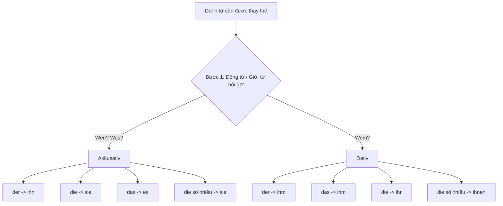

> [!INFO] **Tổng quan**
> Trong tiếng Đức, **Personalpronomen (Đại từ nhân xưng)** dùng để xưng hô hoặc thay thế cho một danh từ đã được đề cập trước đó nhằm tránh lặp từ. Việc xác định đúng dạng đại từ trong **Akkusativ (Cách 4)** và **Dativ (Cách 3)** là chìa khóa để diễn đạt câu tự nhiên và chính xác.

---

> [!INFO]+ Mục tiêu bài học
> Sau khi hoàn thành bài học này, bạn có thể:
> - ✅ Nắm vững bảng Đại từ nhân xưng đầy đủ ở 3 cách: Nominativ, Akkusativ và Dativ.
> - ✅ Sử dụng thành thạo quy trình 2 bước để xác định đúng đại từ thay thế (`ihn`, `ihm`, `sie`, `ihr`, `es`, `ihnen`).
> - ✅ Phân biệt rõ việc thay thế danh từ chỉ **Người** (Dùng đại từ nhân xưng) vs danh từ chỉ **Vật/Sự việc** (Dùng Pronominaladverbien `da(r)-`).
> - ✅ Nắm vững vị trí đại từ trong câu đơn và mệnh đề phụ (`weil`).

---

## 1. Bảng Tổng hợp Đại từ Nhân xưng (Personalpronomen)

> [!TIP] **Mẹo ghi nhớ nhanh dạng biến đổi:**
> - **Ngôi thứ nhất & thứ hai (ich, du, wir, ihr):** 
>   - `ich` $\rightarrow$ **mich** (Akk) $\rightarrow$ **mir** (Dat) *(Đuôi **-ch** biến thành **-r**)*
>   - `du` $\rightarrow$ **dich** (Akk) $\rightarrow$ **dir** (Dat) *(Đuôi **-ch** biến thành **-r**)*
>   - `wir` & `ihr` $\rightarrow$ Giữ nguyên dạng ở cả Akkusativ và Dativ (**uns / euch**).
> - **Ngôi thứ ba số ít (er, sie, es):**
>   - `er` (der) $\rightarrow$ **ihn** (Akk) $\rightarrow$ **ihm** (Dat) *(Đuôi **-n** thành **-m**)*
>   - `sie` (die) $\rightarrow$ **sie** (Akk - giữ nguyên) $\rightarrow$ **ihr** (Dat)
>   - `es` (das) $\rightarrow$ **es** (Akk - giữ nguyên) $\rightarrow$ **ihm** (Dat - giống `er`)
> - **Số nhiều & Lịch sự (sie, Sie):**
>   - `sie` (họ) $\rightarrow$ **sie** (Akk) $\rightarrow$ **ihnen** (Dat)
>   - `Sie` (Ngài) $\rightarrow$ **Sie** (Akk) $\rightarrow$ **Ihnen** (Dat - viết hoa)

| Ngôi | Nominativ (Chủ ngữ) | Akkusativ (Tân ngữ trực tiếp) | Dativ (Tân ngữ gián tiếp) | Nghĩa tiếng Việt (Dativ) | Mẹo nhớ dạng Akkusativ & Dativ |
| :--- | :--- | :--- | :--- | :--- | :--- |
| **Tôi** | **ich** | **mich** | **mir** | cho tôi / với tôi | mi**ch** $\rightarrow$ mi**r** |
| **Bạn** | **du** | **dich** | **dir** | cho bạn / với bạn | di**ch** $\rightarrow$ di**r** |
| **Anh ấy / Giống đực (der)** | **er** | **ihn** | **ihm** | cho anh ấy | ih**n** $\rightarrow$ ih**m** |
| **Cô ấy / Giống cái (die)** | **sie** | **sie** | **ihr** | cho cô ấy | Akk giữ `sie`, Dat thành `ihr` |
| **Nó / Giống trung (das)** | **es** | **es** | **ihm** | cho nó | Akk giữ `es`, Dat giống đực (`ihm`) |
| **Chúng tôi** | **wir** | **uns** | **uns** | cho chúng tôi | Akk & Dat **giống hệt nhau** (`uns`) |
| **Các bạn** | **ihr** | **euch** | **euch** | cho các bạn | Akk & Dat **giống hệt nhau** (`euch`) |
| **Họ** | **sie** | **sie** | **ihnen** | cho họ | Akk `sie`, Dat thành `ihnen` |
| **Ngài / Quý vị** | **Sie** | **Sie** | **Ihnen** | cho Ngài / Quý vị | Akk `Sie`, Dat thành `Ihnen` |

---

## 2. Quy trình 2 bước chọn chính xác Đại từ Thay thế

Khi cần thay thế một danh từ bằng đại từ nhân xưng, hãy trả lời **2 câu hỏi theo đúng thứ tự**:

### Bước 1: Động từ / Giới từ đòi cách nào (Kasus)?
- Động từ trả lời câu hỏi **Wen?** (Ai?) hoặc **Was?** (Cái gì?) $\rightarrow$ **Akkusativ**.
- Động từ trả lời câu hỏi **Wem?** (Cho ai / Với ai?) $\rightarrow$ **Dativ**.

### Bước 2: Danh từ gốc mang mạo từ/giống gì?
- Danh từ giống đực (`der`) $\rightarrow$ Akkusativ: **ihn** | Dativ: **ihm**
- Danh từ giống cái (`die`) $\rightarrow$ Akkusativ: **sie** | Dativ: **ihr**
- Danh từ giống trung (`das`) $\rightarrow$ Akkusativ: **es** | Dativ: **ihm**
- Danh từ số nhiều (`die Pl.`) $\rightarrow$ Akkusativ: **sie** | Dativ: **ihnen**

> [!WARNING] **Sai lầm phổ biến của người Việt:**
> Đừng suy nghĩ theo tiếng Việt *"cái báo cáo là đồ vật nên gọi là 'nó' (es)"*. Trong tiếng Đức, **giống ngữ pháp của danh từ** quyết định đại từ:
> - `der Bericht` (bản báo cáo - giống đực) $\rightarrow$ Phải dùng **ihn** (Akkusativ) hoặc **ihm** (Dativ), **không bao giờ** dùng `es`.

---

## 3. Phân tích Ví dụ Thực tế

### Ví dụ 1: Thay thế danh từ giống đực (`der Bericht`) ở Akkusativ
> **Gốc:** *Sie braucht **den wichtigen Bericht**.* (Cô ấy cần bản báo cáo quan trọng.)
> 
> 1. **Bước 1:** `brauchen` hỏi *Was braucht sie?* $\rightarrow$ **Akkusativ**.
> 2. **Bước 2:** Danh từ gốc là `der Bericht` (giống đực `der`).
> 3. **Kết luận:** Akkusativ + `der` $\rightarrow$ **ihn**.
> 
> $\rightarrow$ **Sie braucht ihn.** *(Cô ấy cần nó / bản báo cáo đó.)*

---

### Ví dụ 2: Đặt Akkusativ và Dativ cạnh nhau với cùng một danh từ (`der Kollege`)

- **Chủ ngữ (Nominativ):**
  > *Der Kollege ist nett.* $\rightarrow$ **Er** ist nett. *(Anh ấy tốt bụng.)*
- **Tân ngữ trực tiếp (Akkusativ - *Wen?*):**
  > *Ich sehe **den Kollegen**.* $\rightarrow$ Ich sehe **ihn**. *(Tôi nhìn thấy anh ấy.)*
- **Tân ngữ gián tiếp (Dativ - *Wem?*):**
  > *Ich helfe **dem Kollegen**.* $\rightarrow$ Ich helfe **ihm**. *(Tôi giúp đỡ anh ấy.)*

---

### Ví dụ 3: So sánh bảng thay thế cho cả 4 giống danh từ

| Danh từ gốc | Câu đầy đủ | Câu dùng đại từ thay thế | Giải thích Kasus |
| :--- | :--- | :--- | :--- |
| **der Tisch** (đực) | Ich kaufe **den Tisch**. | Ich kaufe **ihn**. | `kaufen` + Akk (`der` $\rightarrow$ **ihn**) |
| **die Tasche** (cái) | Ich sehe **die Tasche**. | Ich sehe **sie**. | `sehen` + Akk (`die` $\rightarrow$ **sie**) |
| **das Buch** (trung) | Ich brauche **das Buch**. | Ich brauche **es**. | `brauchen` + Akk (`das` $\rightarrow$ **es**) |
| **die Frau** (cái) | Ich helfe **der Frau**. | Ich helfe **ihr**. | `helfen` + Dat (`die` $\rightarrow$ **ihr**) |
| **die Kinder** (số nhiều) | Er dankt **den Kindern**. | Er dankt **ihnen**. | `danken` + Dat (`die Pl.` $\rightarrow$ **ihnen**) |

---

## 4. Vị trí của Đại từ Nhân xưng trong Câu & Mệnh đề phụ (`weil`)

### 4.1. Vị trí trong câu đơn
Đại từ nhân xưng đại diện cho thông tin đã biết, nên thường đứng **ngay sau động từ đã chia** (hoặc đứng trước danh từ tân ngữ khác):

> *Ich gebe **ihm** (Dat) **das Buch** (Akk).*
> *(Tôi đưa cho anh ấy cuốn sách.)*

Nếu cả 2 tân ngữ đều là đại từ, **Akkusativ đứng trước Dativ**:
> *Ich gebe **es** (Akk) **ihm** (Dat).*

---

### 4.2. Vị trí trong mệnh đề phụ với `weil` (Nebensatz)
Trong mệnh đề phụ bắt đầu bằng `weil`, chủ ngữ đứng ngay sau `weil`, theo sau là các đại từ tân ngữ, và động từ chia đẩy xuống cuối câu.

> [!EXAMPLE] **Phân tích câu phức:**
> *Wenn meine nette Kollegin heute keine Zeit hat, schicke ich ihr den wichtigen Bericht, **weil sie ihn morgen braucht**.*
> 
> Phân tích mệnh đề `weil sie ihn morgen braucht`:
> - **weil**: Liên từ mở đầu mệnh đề phụ.
> - **sie**: Chủ ngữ (cô ấy).
> - **ihn**: Đại từ Akkusativ thay cho `den wichtigen Bericht` (`der Bericht` + Akkusativ).
> - **morgen**: Trạng từ chỉ thời gian.
> - **braucht**: Động từ đã chia đứng ở cuối mệnh đề phụ.

---

## 5. Nhóm Động từ Thường gặp với Akkusativ & Dativ

Để chọn đúng đại từ, việc thuộc nhóm động từ đi với cách nào là bắt buộc:

| Nhóm Động từ đi với **Akkusativ** (*Wen / Was?*) | Nhóm Động từ đi với **Dativ** (*Wem?*) |
| :--- | :--- |
| **sehen** (nhìn thấy) $\rightarrow$ *Ich sehe **ihn**.* | **helfen** (giúp đỡ) $\rightarrow$ *Ich helfe **ihm**.* |
| **brauchen** (cần) $\rightarrow$ *Sie braucht **es**.* | **danken** (cảm ơn) $\rightarrow$ *Wir danken **ihr**.* |
| **haben** (có) $\rightarrow$ *Er hat **sie**.* | **gefallen** (thích/vừa ý) $\rightarrow$ *Das gefällt **mir**.* |
| **kaufen** (mua) $\rightarrow$ *Wir kaufen **ihn**.* | **antworten** (trả lời) $\rightarrow$ *Er antwortet **ihnen**.* |
| **finden** (thấy/đánh giá) $\rightarrow$ *Ich finde **dich** nett.* | **gehören** (thuộc về) $\rightarrow$ *Das gehört **ihm**.* |
| **suchen** (tìm kiếm) $\rightarrow$ *Sie sucht **uns**.* | **zuhören** (lắng nghe) $\rightarrow$ *Hör **mir** zu!* |
| **lieben** (yêu) $\rightarrow$ *Er liebt **sie**.* | **glauben** (tin tưởng) $\rightarrow$ *Ich glaube **dir**.* |

---

## 6. Đại từ đi với Giới từ: Người vs. Vật / Sự việc

Khi câu chứa giới từ (ví dụ: `warten auf`, `denken an`, `sprechen mit`), cách thay thế đại từ phụ thuộc vào đối tượng được nhắc đến là **Người** hay **Vật/Sự việc**.

### 6.1. Khi đối tượng là NGƯỜI: Giới từ + Đại từ nhân xưng
Giữ nguyên giới từ và dùng đúng dạng Akkusativ / Dativ của đại từ nhân xưng:

| Câu với danh từ chỉ người           | Thay bằng đại từ nhân xưng | Từ để hỏi người          |
| :---------------------------------- | :------------------------- | :----------------------- |
| Ich warte auf **meinen Bruder**.    | Ich warte auf **ihn**.     | **Auf wen** wartest du?  |
| Ich denke an **meine Mutter**.      | Ich denke an **sie**.      | **An wen** denkst du?    |
| Ich spreche mit **meinem Lehrer**.  | Ich spreche mit **ihm**.   | **Mit wem** sprichst du? |
| Wir träumen von **unseren Eltern**. | Wir träumen von **ihnen**. | **Von wem** träumt ihr?  |

---

### 6.2. Khi đối tượng là VẬT / SỰ VIỆC: Dùng `da(r)-` + Giới từ (Pronominaladverbien)
Với vật hoặc khái niệm trừu tượng, không dùng đại từ nhân xưng sau giới từ mà ghép **`da-` (hoặc `dar-` nếu giới từ bắt đầu bằng nguyên âm)** vào trước giới từ:

| Câu với danh từ chỉ vật | Thay bằng Pronominaladverb | Từ để hỏi vật |
| :--- | :--- | :--- |
| Ich warte auf **den Bus**. | Ich warte **darauf**. | **Worauf** wartest du? |
| Ich denke an **den Termin**. | Ich denke **daran**. | **Woran** denkst du? |
| Wir sprechen über **das Problem**. | Wir sprechen **darüber**. | **Worüber** sprecht ihr? |
| Sie interessiert sich für **Deutsch**. | Sie interessiert sich **dafür**. | **Wofür** interessiert sie sich? |
| Er träumt von **einer Reise**. | Er träumt **davon**. | **Wovon** träumt er? |
| Wir fangen mit **der Übung** an. | Wir fangen **damit** an. | **Womit** fangt ihr an? |

> [!NOTE] **Quy tắc ghép `da(r)-` & `wo(r)-`:**
> - Nếu giới từ bắt đầu bằng nguyên âm (*auf, an, über*): Thêm **r** $\rightarrow$ `darauf`, `daran`, `darüber` / `worauf`, `woran`, `worüber`.
> - Nếu giới từ bắt đầu bằng phụ âm (*für, mit, von, zu*): Không thêm **r** $\rightarrow$ `dafür`, `damit`, `davon`, `dazu` / `wofür`, `womit`, `wovon`, `wozu`.

---

## 7. Các Lỗi Thường Gặp & Mẹo Tránh (Common Pitfalls)

> [!CAUTION] **3 Lỗi kinh điển cần tránh:**
> 
> 1. **Dùng sai đại từ cho đồ vật theo tư duy tiếng Việt:**
>    - ❌ *Ich kaufe den Stuhl. Ich kaufe es.*
>    - ✅ *Ich kaufe den Stuhl. Ich kaufe **ihn**.* (Vì `der Stuhl` là giống đực).
>
> 2. **Nhầm lẫn giữa `ihn` (Akkusativ) và `ihm` (Dativ):**
>    - Nhớ quy tắc đuôi: **ihN** đi với Akkusativ (giống `deN`), **ihM** đi với Dativ (giống `deM`).
>
> 3. **Nhầm lẫn giữa `ihr` (cô ấy - Dativ) và `ihren` / `ihm`:**
>    - `die Frau` (Dativ) $\rightarrow$ **ihr** (*Ich helfe ihr*).
>    - `die Frau` (Akkusativ) $\rightarrow$ **sie** (*Ich sehe sie*).