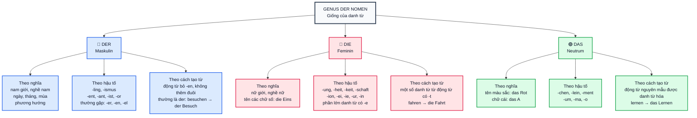

> [!INFO]+ Mục tiêu bài học
> Sau khi hoàn thành bài này, bạn có thể:
> - ✅ Nhận biết nhanh một số dấu hiệu của `der`, `die`, `das` theo **nghĩa**, **hậu tố** và **cách tạo từ**.
> - ✅ Phân biệt quy tắc đáng tin cậy với mẹo chỉ mang tính xu hướng.
> - ✅ Ghi nhớ danh từ bằng màu sắc: 🔵 `der` — 🔴 `die` — 🟢 `das`.

> [!NOTE] Nguồn tổng hợp
> Bài này tổng hợp các mẹo trong tài liệu bổ sung và kiến thức nền tại [[15_Genus_der_Nomen__]].

---

## 1. Sơ đồ tổng hợp (Graph)

> [!WARNING] Đây là dấu hiệu nhận biết, không phải công thức đúng 100%
> Hậu tố thường đáng tin cậy hơn việc đoán theo nghĩa. Nếu không chắc, hãy tra từ điển và học cả cụm **Artikel + Nomen + Plural**.

---

## 2. Mẹo nhớ nhanh `der` — giống đực (Maskulinum)

### Theo nghĩa

| Nhóm | Ví dụ |
| :--- | :--- |
| Người nam, nghề nghiệp của nam | `der Lehrer` *(thầy giáo)*, `der Arzt` *(bác sĩ nam)* |
| Ngày, tháng, mùa | `der Montag`, `der Januar`, `der Frühling` |
| Phương hướng | `der Norden`, `der Süden`, `der Osten`, `der Westen` |

### Theo hậu tố

| Dấu hiệu | Ví dụ | Mức độ |
| :--- | :--- | :--- |
| `-ling`, `-ismus` | `der Liebling`, `der Tourismus` | Rất hữu ích |
| `-ent`, `-ant`, `-ist`, `-or` | `der Präsident`, `der Konsonant`, `der Polizist`, `der Motor` | Thường là `der` |
| `-er`, `-en`, `-el` | `der Computer`, `der Garten`, `der Schlüssel` | Có nhiều ngoại lệ |

### Theo cách tạo từ

Một số danh từ được tạo từ động từ bằng cách bỏ `-en` và không thêm hậu tố thường là `der`:

- `besuchen` → `der Besuch` *(chuyến thăm)*
- `beginnen` → `der Beginn` *(sự bắt đầu)*

> [!CAUTION] Không áp dụng máy móc
> `spielen` → `das Spiel`, vì vậy cách tạo từ này chỉ là một mẹo nhận biết.

---

## 3. Mẹo nhớ nhanh `die` — giống cái (Femininum)

### Theo nghĩa

| Nhóm | Ví dụ |
| :--- | :--- |
| Người nữ, nghề nghiệp của nữ | `die Lehrerin`, `die Ärztin` |
| Tên của chữ số | `die Eins`, `die Zehn` |

### Theo hậu tố

| Dấu hiệu | Ví dụ | Mức độ |
| :--- | :--- | :--- |
| `-ung`, `-heit`, `-keit`, `-schaft` | `die Wohnung`, `die Freiheit`, `die Fähigkeit`, `die Freundschaft` | Rất hữu ích |
| `-ion`, `-ei`, `-ie`, `-ur` | `die Lektion`, `die Bäckerei`, `die Biologie`, `die Kultur` | Rất hữu ích |
| `-in` *(người nữ)* | `die Lehrerin`, `die Ärztin` | Rất hữu ích |
| `-e` | `die Reise`, `die Adresse` | Phần lớn là `die` |

### Theo cách tạo từ

Một số danh từ được tạo từ động từ và kết thúc bằng `-t` là `die`:

- `fahren` → `die Fahrt` *(chuyến đi)*

> [!CAUTION] Có ngoại lệ
> Không phải mọi danh từ loại này đều là `die`: `halten` → `der Halt`.

---

## 4. Mẹo nhớ nhanh `das` — giống trung (Neutrum)

### Theo nghĩa

| Nhóm | Ví dụ |
| :--- | :--- |
| Tên màu sắc được dùng như danh từ | `das Rot`, `das Grün` |
| Tên chữ cái | `das A`, `das B` |

### Theo hậu tố

| Dấu hiệu | Ví dụ | Mức độ |
| :--- | :--- | :--- |
| `-chen`, `-lein` *(dạng thu nhỏ)* | `das Mädchen`, `das Brötchen`, `das Fräulein` | Rất hữu ích |
| `-ment`, `-um` | `das Dokument`, `das Studium` | Rất hữu ích |
| `-ma`, `-o` | `das Thema`, `das Klima`, `das Auto`, `das Radio` | Thường là `das` |

### Theo cách tạo từ

Động từ nguyên mẫu được dùng như danh từ luôn là `das` và phải viết hoa:

- `lernen` → `das Lernen` *(việc học)*
- `leben` → `das Leben` *(cuộc sống)*
- `essen` → `das Essen` *(việc ăn; đồ ăn)*

---

## 5. Những bẫy cần tránh

| Không nên suy luận | Giải thích |
| :--- | :--- |
| “Chỉ người nữ thì luôn là `die`” | `das Mädchen` là giống trung vì hậu tố `-chen`. |
| “Từ vay mượn luôn là `das`” | Không đúng: `der Computer`, `die Pizza`, nhưng `das Radio`. Nguồn gốc nước ngoài không đủ để xác định giống. |
| “Có đuôi `-er` thì luôn là `der`” | Không đúng: `das Fenster`, `die Butter`. |
| “Có đuôi `-e` thì luôn là `die`” | Không đúng: `der Name`, `das Ende`. |
| “Danh từ chỉ đồ vật thì dùng `das`” | Giống ngữ pháp không phụ thuộc vào việc danh từ chỉ người hay đồ vật: `der Tisch`, `die Tasche`, `das Buch`. |

---

## 6. Cách học hiệu quả

### Học cả bộ ba

Không học riêng `Besuch`, hãy học:

| Artikel + Nomen | Plural | Màu ghi nhớ |
| :--- | :--- | :--- |
| `der Besuch` | `die Besuche` | 🔵 Xanh dương |
| `die Fahrt` | `die Fahrten` | 🔴 Đỏ / hồng |
| `das Brötchen` | `die Brötchen` | 🟢 Xanh lá |

### Mẹo nhìn chữ cuối của mạo từ

- `deR` → **R** → `der`
- `diE` → **E** → `die`
- `daS` → **S** → `das`

> [!TIP] Ôn tập
> Che mạo từ và nhìn vào **nghĩa**, **hậu tố**, **cách tạo từ** để dự đoán. Sau đó mở đáp án và kiểm tra lại bằng từ điển. Mục tiêu là ghi nhớ đúng, không phải đoán thật nhiều.
