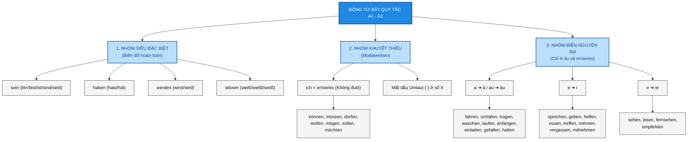

> [!INFO]+ Mục tiêu bài học
> - ✅ Nắm vững toàn bộ hệ thống động từ bất quy tắc và khuyết thiếu (Modalverben) trình độ A1 - A2.
> - ✅ Thuộc lòng các mẹo nhớ nhanh (Mindmap & Thần chú chia đuôi).
> - ✅ Bổ sung bảng tra cứu đầy đủ để luyện tập và viết bài không bị sai.

---

> [!TIP]
> **Thần chú nhớ đuôi động từ chuẩn:** **E – ST – T – EN – T – EN**
> (Tương ứng các ngôi: *ich, du, er/sie/es, wir, ihr, sie/Sie*)

---

## 1. Sơ đồ tư duy tổng quan (Mindmap)

---

## 2. Các nhóm động từ bất quy tắc chi tiết

### 2.1. Nhóm Siêu đặc biệt (Biến đổi hoàn toàn)
Đặc điểm: Biến đổi cả thân động từ, bắt buộc thuộc lòng.

| Động từ | ich | du | er/sie/es | wir | ihr | sie/Sie | Ý nghĩa |
| :--- | :--- | :--- | :--- | :--- | :--- | :--- | :--- |
| **sein** | **bin** | **bist** | **ist** | **sind** | **seid** | **sind** | là / thì / ở |
| **haben** | habe | **hast** | **hat** | haben | habt | haben | có |
| **werden** | werde | **wirst** | **wird** | werden | werdet | werden | trở thành / sẽ |
| **wissen** | **weiß** | **weißt** | **weiß** | wissen | wisst | wissen | biết |

---

### 2.2. Nhóm Động từ khuyết thiếu (Modalverben)

> [!IMPORTANT]
> **2 Quy tắc vàng nhớ Modalverben:**
> 1. Ngôi **`ich` = `er/sie/es`** và **KHÔNG CÓ ĐUÔI**.
> 2. Các ngôi số ít (**`ich`, `du`, `er/sie/es`**) bị **MẤT DẤU ÔM-LÂU (`¨`)**.

| Ngôi | können | müssen | dürfen | wollen | mögen | sollen | möchten |
| :--- | :--- | :--- | :--- | :--- | :--- | :--- | :--- |
| **ich** | **kann** | **muss** | **darf** | **will** | **mag** | **soll** | **möchte** |
| **du** | **kannst** | **musst** | **darfst** | **willst** | **magst** | **sollst** | **möchtest** |
| **er/sie/es** | **kann** | **muss** | **darf** | **will** | **mag** | **soll** | **möchte** |
| **wir** | können | müssen | dürfen | wollen | mögen | sollen | möchten |
| **ihr** | könnt | müsst | dürft | wollt | mögt | sollt | mechtet |
| **sie/Sie** | können | müssen | dürfen | wollen | mögen | sollen | möchten |

---

### 2.3. Nhóm Động từ mạnh biến nguyên âm (Starke Verben)

> [!NOTE]
> **Quy tắc cốt lõi:** Biến đổi nguyên âm **CHỈ XẢY RA ở ngôi `du` và `er/sie/es`**. Các ngôi khác vẫn chia bình thường theo quy tắc chuẩn.

#### A. Nguyên âm `a ➔ ä` và `au ➔ äu`
*Thấy gốc chứa `a` hoặc `au` thì chuyển thành `ä` hoặc `äu`.*

* **fahren** *(đi xe)*: du f**ä**hrst / er f**ä**hrt
* **schlafen** *(ngủ)*: du schl**ä**fst / er schl**ä**ft
* **tragen** *(mang/mặc)*: du tr**ä**gst / er tr**ä**gt
* **waschen** *(giặt/rửa)*: du w**ä**schst / er w**ä**scht
* **laufen** *(chạy)*: du l**äu**fst / er l**äu**ft
* **halten** *(dừng lại)*: du h**ä**ltst / er h**ä**lt
* **gefallen** *(thích/hợp)*: du gef**ä**llst / er gef**ä**llt
* **anfangen** *(bắt đầu)*: du f**ä**ngst an / er f**ä**ngt an
* **einladen** *(mời)*: du l**ä**dst ein / er l**ä**dt ein

#### B. Nguyên âm `e ➔ i`
*Thấy gốc chứa `e` (đa số), chuyển thành `i`.*

* **sprechen** *(nói)*: du spr**i**chst / er spr**i**cht
* **geben** *(cho/đưa)*: du g**i**bst / er g**i**bt
* **helfen** *(giúp đỡ)*: du h**i**lfst / er h**i**lft
* **essen** *(ăn)*: du **i**sst / er **i**sst
* **treffen** *(gặp mặt)*: du tr**i**ffst / er tr**i**fft
* **nehmen** *(lấy/chọn món)*: du n**i**mmst / er n**i**mmt
* **vergessen** *(quên)*: du verg**i**sst / er verg**i**sst
* **mitnehmen** *(mang theo)*: du n**i**mmst mit / er n**i**mmt mit

#### C. Nguyên âm `e ➔ ie`
*Chỉ áp dụng cho 4 từ hay gặp kéo dài nguyên âm `e`.*

* **sehen** *(nhìn/xem)*: du s**ie**hst / er s**ie**ht
* **lesen** *(đọc)*: du l**ie**st / er l**ie**st
* **fernsehen** *(xem tivi)*: du s**ie**hst fern / er s**ie**ht fern
* **empfehlen** *(khuyên/giới thiệu)*: du empf**ie**hlst / er empf**ie**hlt

---

## 3. Luyện tập nhanh (Übungen)

Hãy chia động từ trong ngoặc cho đúng:

1. Anton ________ (fahren) morgen nach Berlin.
2. ________ (können) du mir helfen?
3. Sie (cô ấy) ________ (lesen) ein Buch.
4. Wir ________ (müssen) heute viel lernen.
5. Was ________ (essen) du am Abend?

🔑 Đáp án bài tập

1. **fährt** (gốc *a ➔ ä*)
2. **Kannst** (ngôi *du* của *können*)
3. **liest** (gốc *e ➔ ie*)
4. **müssen** (ngôi *wir* giữ nguyên mẫu)
5. **isst** (gốc *e ➔ i*)

---

## 🔗 Liên kết bài học liên quan
* [[02_Grammatik/01_A1/13_Verbkonjugation_im_Präsens__]]
* [[02_Grammatik/01_A1/09_Modalverben]]
* [[02_Grammatik/02_A2/04_Präteritum_Sein_Haben_und_Modalverben]]
