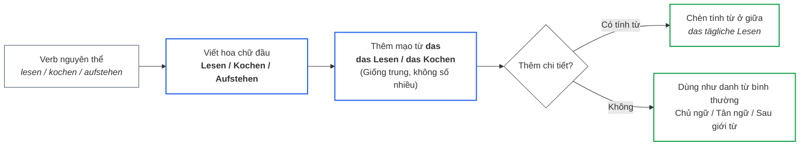
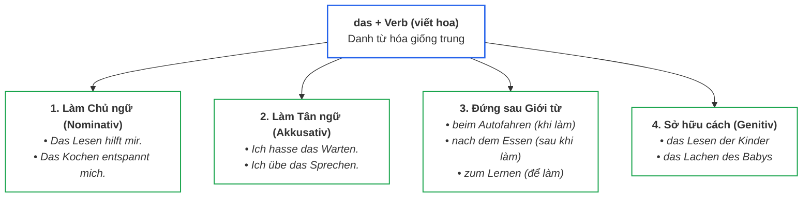

> [!info] Tổng quan
> Trong tiếng Anh ta dùng **V-ing** (Gerund) để biến động từ thành danh từ: *Reading is fun*. Tiếng Đức **không có đuôi V-ing** — thay vào đó dùng cấu trúc **das + Verb (viết hoa)**. Đây gọi là **Nominalisierung** (danh từ hóa động từ).
> 
> Liên quan: [[02_Grammatik/01_A1/13_Verbkonjugation_im_Präsens__|Infinitiv]] • [[02_Grammatik/02_A2/15_Infinitiv_mit_zu__|Infinitiv mit zu]] • [[02_Grammatik/02_A2/16_Der_Genitiv__|Der Genitiv]] • [[9999_Schreibübung|Luyện viết]]

---

## 1. Khái niệm cốt lõi

Tiếng Đức tạo danh từ từ động từ theo cách đơn giản: **giữ nguyên dạng nguyên thể, viết hoa chữ cái đầu** và gắn mạo từ **das**:

| Động từ gốc | Danh từ hóa (Nominalisierung) | Nghĩa tiếng Việt | Tương đương tiếng Anh |
| :--- | :--- | :--- | :--- |
| `lesen` *(đọc)* | **das Lesen** | việc đọc, sự đọc | reading |
| `schwimmen` *(bơi)* | **das Schwimmen** | việc bơi lội | swimming |
| `kochen` *(nấu ăn)* | **das Kochen** | việc nấu nướng | cooking |
| `warten` *(chờ đợi)* | **das Warten** | việc chờ đợi | waiting |
| `leben` *(sống)* | **das Leben** | cuộc sống | living / life |

> [!important] 2 Quy tắc bất biến của Nominalisierung
> 1. **100% luôn mang giống trung (`das` - 🟢 Xanh lá):** Không bao giờ có trường hợp giống đực (*der*) hay giống cái (*die*).
> 2. **CHỈ CÓ SỐ ÍT (Singulariatantum):** Tuyệt đối **không có dạng số nhiều** *(không bao giờ tồn tại die Lesen hay die Kochen)*.

---

## 2. Quy tắc tạo & Quy trình chuyển hóa

Sơ đồ quy trình 3 bước chuyển hóa một động từ thành danh từ:

- **Áp dụng cho mọi động từ:** Không cần chia đuôi, không cần thêm hậu tố.
- **Động từ tách (trennbare Verben) & Động từ ghép:** Ghép liền nguyên thể lại rồi viết hoa chữ đầu:
  - *anrufen* $\rightarrow$ **das Anrufen** *(việc gọi điện)*
  - *einkaufen* $\rightarrow$ **das Einkaufen** *(việc đi mua sắm)*
  - *aufstehen* $\rightarrow$ **das Aufstehen** *(việc thức dậy)*
  - *Auto fahren* $\rightarrow$ **das Autofahren** *(việc lái xe ô tô)*
- **Chèn tính từ bổ nghĩa ở giữa:** Tính từ chia đuôi bình thường theo giống trung:
  - *das tägliche Lesen* *(việc đọc sách hàng ngày)*
  - *das laute Sprechen* *(việc nói to)*

---

## 3. Vai trò của danh từ hóa trong câu

Vì đã trở thành một danh từ thực thụ mang giống trung (`das`), nó có thể đảm nhiệm 4 vai trò chính:

### 3.1. Chi tiết ví dụ làm Chủ ngữ (Nominativ)
- *„**Das Lesen** hilft mir, besser einzuschlafen.“* *(Việc đọc sách giúp tôi dễ ngủ hơn).*
- *„**Das Kochen** entspannt mich nach der Arbeit.“* *(Nấu ăn giúp tôi thư giãn sau giờ làm).*
- *„**Das Frühaufstehen** fällt mir schwer.“* *(Việc dậy sớm rất khó với tôi).*
- *„**Das Autofahren** in Hanoi ist anstrengend.“* *(Việc lái xe ở Hà Nội rất mệt mỏi).*

### 3.2. Chi tiết ví dụ làm Tân ngữ trực tiếp (Akkusativ)
- *„Ich hasse **das Warten** am Flughafen.“* *(Tôi ghét việc chờ đợi ở sân bay).*
- *„Sie hat **das Fahrradfahren** in einer Woche gelernt.“* *(Cô ấy học đạp xe trong một tuần).*
- *„Ich übe jeden Tag **das Sprechen**.“* *(Tôi luyện nói mỗi ngày).*

> [!tip] Nhóm từ vựng học ngôn ngữ
> Các kỹ năng ngôn ngữ đều dùng danh từ hóa này: **das Lernen** *(việc học)*, **das Sprechen** *(kỹ năng nói)*, **das Schreiben** *(kỹ năng viết)*, **das Hören** *(kỹ năng nghe)*, **das Lesen** *(kỹ năng đọc)*.

---

## 4. Danh từ hóa đi với Giới từ (Trọng tâm thực chiến A2)

Khi đứng sau giới từ, mạo từ `das` sẽ biến đổi theo cách mà giới từ đó yêu cầu:

| Giới từ | Dạng kết hợp | Ý nghĩa | Ví dụ thực tế |
| :--- | :--- | :--- | :--- |
| **`bei + dem`** | **`beim` + Verb** | **Khi / trong lúc làm gì** | * **Beim Autofahren** darf man nicht telefonieren.* *(Khi đang lái xe thì không được gọi điện).* |
| **`nach + dem`** | **nach dem + Verb** | **Sau khi làm gì** | * **Nach dem Essen** wasche ich ab.* *(Sau khi ăn xong thì tôi rửa bát).* |
| **`durch + das`** | **durch das + Verb** | **Nhờ vào / qua việc...** | * **Durch das tägliche Lernen** verbessert man sich.* *(Nhờ việc học mỗi ngày mà người ta tiến bộ).* |
| **`zu + dem`** | **`zum` + Verb** | **Để phục vụ việc gì** | *Ich brauche eine Brille **zum Lesen**.* *(Tôi cần kính để đọc sách).* |
| **`für + das`** | **für das + Verb** | **Cho việc gì** | *Ich habe kein Talent **für das Kochen**.* *(Tôi không có khiếu nấu ăn).* |

---

## 5. Mẹo dùng tự nhiên: Danh từ hóa vs Danh từ gốc có sẵn

Trong tiếng Đức, một số hành động đã có sẵn **danh từ gốc**:
- Động từ *umziehen* (chuyển nhà) $\rightarrow$ Đã có danh từ gốc: **`der Umzug`**.
- Động từ *warten* (chờ đợi) $\rightarrow$ Đã có danh từ gốc: **`die Wartezeit`**.

| Nghĩa tiếng Việt | Nominalisierung (đúng, hơi văn viết) | Dùng danh từ gốc (tự nhiên hơn trong văn nói) |
| :--- | :--- | :--- |
| Sau khi chuyển nhà... | *Nach dem Umziehen nach Berlin...* | *Nach **dem Umzug** nach Berlin...* |
| Thời gian chờ đợi rất lâu | *Das Warten war sehr lang.* | *Die **Wartezeit** war rất lang.* |

> [!note] Bỏ mạo từ sau `sein / werden`
> Sau động từ liên kết `sein` hoặc `werden`, bạn có thể lược bỏ `das`:
> - *„**Das Kochen** ist mein Hobby.“* = *„**Kochen** ist mein Hobby.“* (Cả hai đều đúng chuẩn).

---

## 6. Liên kết mở rộng

> [!info] Phân biệt với các cấu trúc liên quan
> - **Khi nào dùng `zu + Infinitiv` thay vì `das + Verb`?** Xem chi tiết tại: [[02_Grammatik/02_A2/15_Infinitiv_mit_zu__|15_Infinitiv_mit_zu__]].
>   *(Nguyên tắc: `das + Verb` nhấn mạnh bản chất/khái niệm chung; `zu + Infinitiv` nhấn mạnh hành động cụ thể trong tình huống).*
> - **Cách biểu thị sở hữu của hành động danh từ hóa (Genitiv):** Xem chi tiết tại: [[02_Grammatik/02_A2/16_Der_Genitiv__|16_Der_Genitiv__]].
>   *(Ví dụ: das Lesen **der Kinder** = việc đọc của trẻ con).*

---

## 7. Tóm tắt ghi nhớ nhanh

1. **Công thức:** `das + Verb nguyên thể viết hoa` (*das Essen, das Trinken, das Schlafen*).
2. **Đặc điểm:** Luôn là **giống trung (`das`)** và **không có số nhiều**.
3. **Bộ tứ giới từ vàng:**
   - **`beim`** = trong khi làm gì (*beim Kochen*).
   - **`nach dem`** = sau khi làm gì (*nach dem Essen*).
   - **`zum`** = để làm gì (*zum Lernen*).
   - **`durch das`** = nhờ việc làm gì (*durch das Training*).
4. **Văn nói:** Ưu tiên dùng danh từ gốc có sẵn nếu có (*der Umzug, die Wartezeit*).
