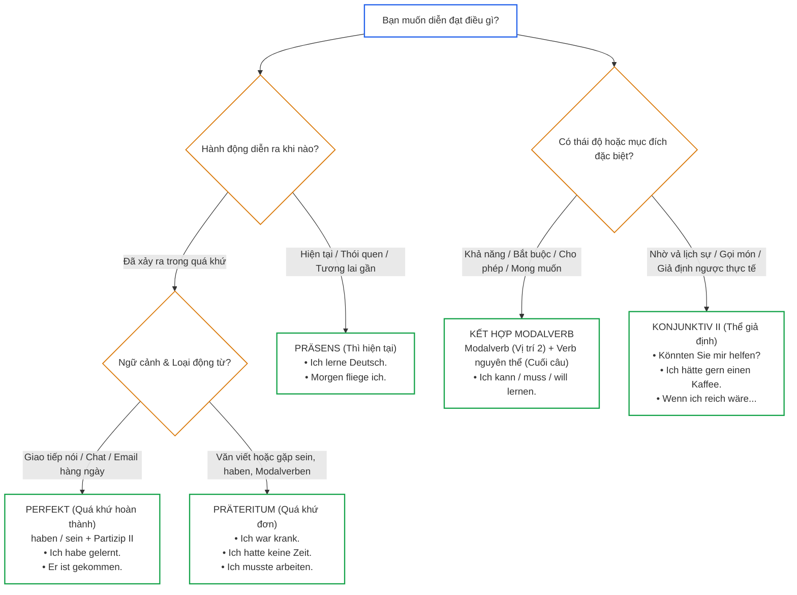
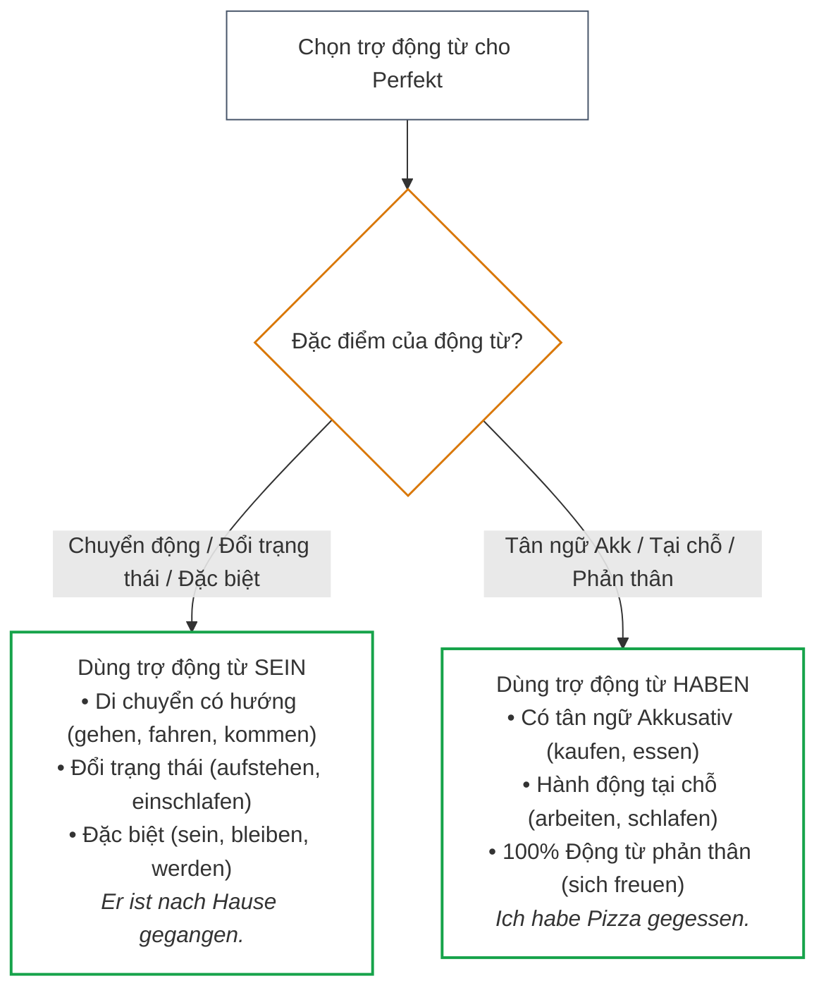
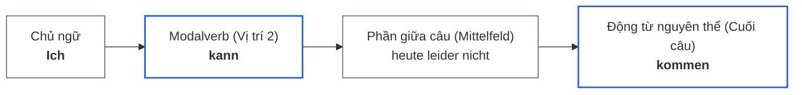
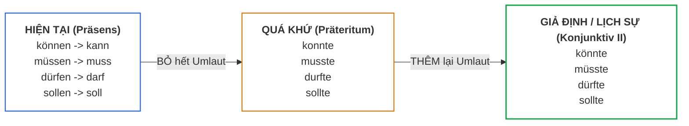
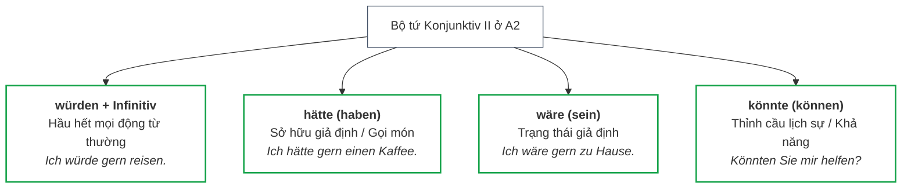

> [!info] Tổng quan
> Bản tra cứu lý thuyết tổng hợp về **Thời gian (Zeitformen / Tempora)**, **Động từ khuyết thiếu (Modalverben)** và **Thể giả định / Lịch sự (Konjunktiv II)** từ A1 đến A2. 
> 
> Liên quan: [[02_Grammatik/01_A1/13_Verbkonjugation_im_Präsens__|Präsens]] • [[02_Grammatik/01_A1/10_Perfekt|Perfekt]] • [[02_Grammatik/02_A2/04_Präteritum_Sein_Haben_und_Modalverben|Präteritum]] • [[02_Grammatik/01_A1/09_Modalverben|Modalverben]] • [[02_Grammatik/02_A2/07_Konjunktiv_II|Konjunktiv II]] • [[99_Docs/01_Basisgrammatik|Basisgrammatik]]

---

## 1. Cây quyết định chọn Thì trong 3 giây

Xác định nhanh thì và thể thức theo mục đích nói:

---

## 2. Ba thì thời gian cơ bản (Zeitformen)

| Thì | Công thức cốt lõi | Khi nào dùng? | Ví dụ |
| :--- | :--- | :--- | :--- |
| **Präsens** *(Hiện tại)* | Gốc động từ + **e - st - t - en - t - en** | • Hành động đang xảy ra • Thói quen, sự thật hiển nhiên • **Tương lai chắc chắn** (+ mốc thời gian) | *Ich lerne jetzt Deutsch.* *Jeden Tag trinke ich Kaffee.* *Morgen fliege ich nach Berlin.* |
| **Perfekt** *(Quá khứ nói)* | **haben / sein** (Vị trí 2) + ... + **Partizip II** (cuối câu) | • **95% giao tiếp đời thường**: nói chuyện, chat, email cá nhân về việc đã xong | *Ich habe viel gelernt.* *Er ist nach Hause gekommen.* |
| **Präteritum** *(Quá khứ viết)* | Động từ chia ở cột Präteritum (Vị trí 2) | • Báo chí, sách truyện, văn viết học thuật • **Bắt buộc dùng cho `sein`, `haben`, `Modalverben`** thay cho Perfekt | *Gestern war ich krank.* *Ich hatte keine Zeit.* *Ich musste arbeiten.* |

### Sơ đồ chọn trợ động từ cho Perfekt (haben hay sein?)

> [!tip] Cách tạo nhanh Partizip II
> - Động từ thường: **`ge-`** + gốc + **`-t`** (*gemacht*).
> - Động từ tách: **tiền tố** + **`ge-`** + gốc + **`-t / -en`** (*eingekauft, angekommen*).
> - Động từ không tách (*be-, ver-, er-...*) hoặc đuôi `-ieren`: **KHÔNG có `ge-`** (*verstanden, studiert*).

---

## 3. Chuyên đề Modalverben (Động từ khuyết thiếu)

Modalverben bổ sung thái độ, khả năng hoặc sự bắt buộc cho hành động chính.

### 3.1. Bảng ý nghĩa 6 Modalverben & `möchten`

| Động từ | Bản chất | Ngữ cảnh sử dụng | Ví dụ |
| :--- | :--- | :--- | :--- |
| **`können`** | Khả năng | Có năng lực làm gì hoặc hoàn cảnh cho phép | *Ich **kann** schwimmen.* |
| **`müssen`** | Bắt buộc | Phải làm do luật lệ, quy luật, mệnh lệnh khách quan | *Ich **muss** heute arbeiten.* |
| **`dürfen`** | Được phép | Có sự cho phép từ người khác / luật | *Hier **darf** man parken.* |
| **`sollen`** | Bổn phận | Lời dặn dò, yêu cầu từ người thứ ba (bác sĩ, sếp) | *Der Arzt sagt, ich **soll** schlafen.* |
| **`wollen`** | Quyết tâm | Ý muốn chủ quan mạnh mẽ của bản thân | *Ich **will** die B1-Prüfung bestehen.* |
| **`mögen`** | Thích | Thường đi trực tiếp với danh từ | *Ich **mag** Schokolade.* |
| **`möchten`** | Muốn lịch sự | Dùng gọi món, xin hẹn lịch sự (thay cho `wollen`) | *Ich **möchte** einen Termin.* |

> [!caution] Phân biệt `nicht müssen` vs `nicht dürfen`
> - **`nicht müssen`** = Không bắt buộc (làm hay không tùy ý): *Du musst nicht kommen.*
> - **`nicht dürfen`** = **CẤM TUYỆT ĐỐI** (làm là vi phạm): *Du darfst hier nicht rauchen.*

### 3.2. Khung vị từ (Satzklammer) với Modalverb

Trong câu chính, Modalverb chia ở **Vị trí 2**, động từ chính ở **nguyên thể (Infinitiv) đứng cuối câu**:

---

## 4. Ma trận biến đổi Modalverben: Hiện tại $\rightarrow$ Quá khứ $\rightarrow$ Giả định

Sự chuyển đổi hình thái của Modalverben qua các thì và thể:

### Bảng đối chiếu hình thái chia theo ngôi

| Động từ gốc | Hiện tại (Präsens) *(ich / er)* | Quá khứ (Präteritum) *(ich / er)* | Konjunktiv II *(ich / er)* | Sắc thái Konjunktiv II |
| :--- | :--- | :--- | :--- | :--- |
| **`können`** | kann | **konnte** *(đã có thể)* | **könnte** | *liệu có thể...* (thỉnh cầu lịch sự / giả định) |
| **`müssen`** | muss | **musste** *(đã phải)* | **müsste** | *đáng lẽ phải...* (bắt buộc mang tính giả định) |
| **`dürfen`** | darf | **durfte** *(đã được phép)* | **dürfte** | *có lẽ là, chắc là...* (dự đoán dè dặt) |
| **`sollen`** | soll | **sollte** *(đã nên)* | **sollte** | *nên...* (đưa ra lời khuyên tế nhị) |
| **`wollen`** | will | **wollte** *(đã định)* | *(dùng `würde gern`)* | Không dùng *wollte* cho lịch sự vì trùng Präteritum |
| **`mögen`** | mag | **mochte** *(đã thích)* | **möchte** | *muốn một cách lịch sự* (gọi món, xin hẹn) |

> [!tip] Luật vàng chia Modalverb
> Ở cả 3 cột: Ngôi **`ich`** và ngôi **`er/sie/es`** luôn **giống hệt nhau** (*ich kann = er kann; ich musste = er musste; ich könnte = er könnte*).

---

## 5. Thể giả định & Lịch sự (Konjunktiv II)

Konjunktiv II **không phải là thì thời gian**, mà là **thể thức nói giảm - nói tránh, giả định hoặc lịch sự**. Ở A2, tập trung vào **Bộ tứ từ khóa vàng**:

### Ba ngữ cảnh cốt lõi:
1. **Thỉnh cầu lịch sự & Gọi món:** Thay vì đòi hỏi cộc lốc (*Ich will...*), dùng *„Ich **hätte gern** einen Termin.“* hoặc *„**Könnten** Sie mir helfen?“*.
2. **Giả định trái ngược hiện tại (với „wenn“):** *„Wenn ich reich **wäre**, **würde** ich reisen.“* (Thực tế là chưa giàu).
3. **Lời khuyên tế nhị (với „sollte“):** *„Du **solltest** mehr schlafen.“* (Bạn nên ngủ nhiều hơn).

---

## 6. Năm bẫy tử huyệt cần tránh

| Bẫy sai | Câu sai ❌ | Câu đúng chuẩn ✅ | Giải thích quy tắc |
| :--- | :--- | :--- | :--- |
| **1. Chia cả 2 động từ** | *Ich muss **gehe** nach Hause.* | *Ich muss nach Hause **gehen**.* | Động từ chính luôn ở dạng nguyên thể (Infinitiv) ở cuối câu. |
| **2. Ghép `würde` với Modalverb** | *Ich **würde können** kommen.* | *Ich **könnte** kommen.* | Modalverben đã có dạng Konjunktiv II riêng, tuyệt đối không ghép với `würde`. |
| **3. Dùng `wollte` để nhờ vả** | *Ich **wollte** einen Kaffee.* | *Ich **hätte gern** / **möchte** einen Kaffee.* | `wollte` là quá khứ (*tôi đã định*); lịch sự phải dùng `hätte gern` hoặc `möchte`. |
| **4. Quên bỏ Umlaut ở Präteritum** | *Gestern **müsste** ich arbeiten.* | *Gestern **musste** ich arbeiten.* | `müsste` là giả định; quá khứ sự thật là `musste` (không có dấu hai chấm). |
| **5. Sai vị trí trong mệnh đề phụ** | *..., weil ich **muss** heute arbeiten.* | *..., weil ich heute arbeiten **muss**.* | Trong mệnh đề phụ (`weil, wenn`), Modalverb đã chia đứng ở vị trí chốt chặn cuối cùng. |
