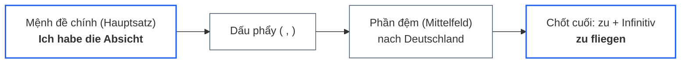
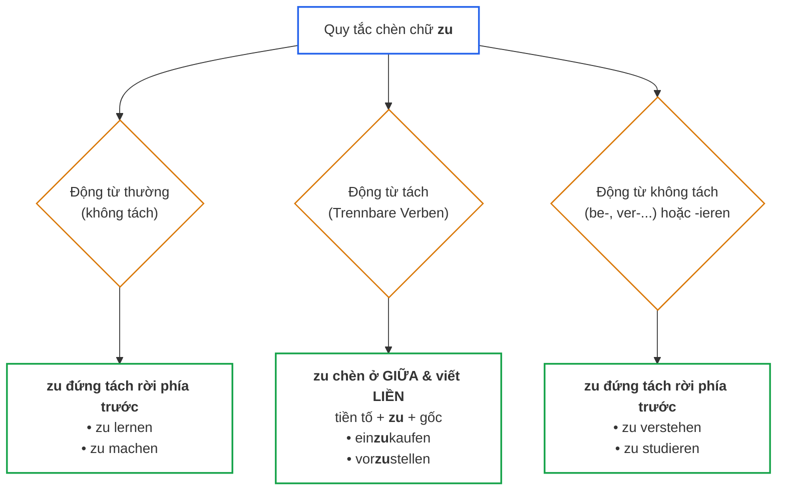
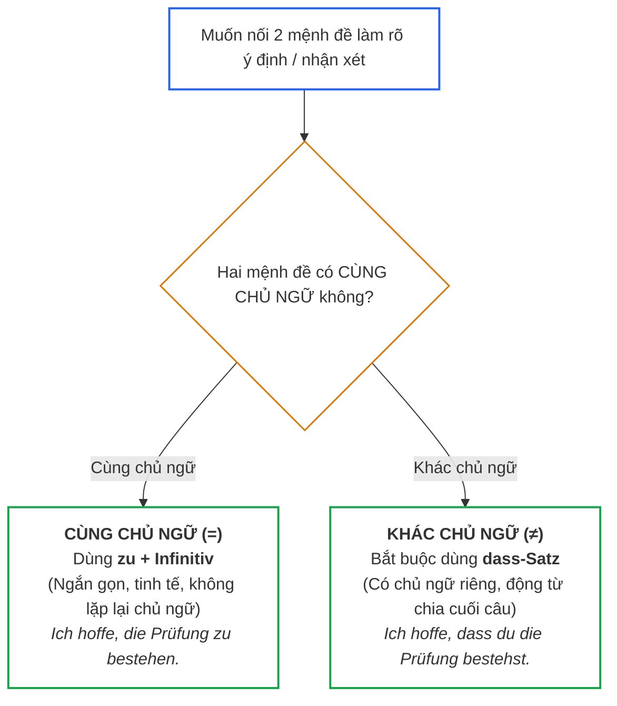

> [!info] Tổng quan
> Cấu trúc **Infinitiv mit „zu“ (Động từ nguyên mẫu có „zu“)** là một trong những công cụ ngữ pháp quan trọng nhất giúp kết nối câu mượt mà, diễn đạt mục đích, ý định hoặc khả năng mà không cần lặp lại chủ ngữ.
> 
> Liên quan: [[02_Grammatik/02_A2/05_Nebensatz_Weil_Dass_Wenn_Als|dass-Satz]] • [[02_Grammatik/02_A2/13_Nominalisierung_Verben_als_Substantive__|Nominalisierung]] • [[02_Grammatik/01_A1/09_Modalverben|Modalverben]] • [[99_Docs/01_Basisgrammatik|Basisgrammatik]]

---

## 1. Bản chất & Vị trí trong câu (Satzklammer)

- **Bản chất:** Động từ chính được giữ ở dạng **nguyên thể (Infinitiv)**, đi kèm chữ **`zu`** và luôn đứng ở **VỊ TRÍ CHỐT CUỐI CÙNG** của mệnh đề.
- **Dấu phẩy (Komma):** Mệnh đề `zu + Infinitiv` luôn được ngăn cách với mệnh đề chính bằng một **dấu phẩy**.

---

## 2. Ba nhóm từ bắt buộc kích hoạt „zu + Infinitiv“

Tiếng Đức sử dụng cấu trúc này sau **3 nhóm từ điển hình**:

### 2.1. Nhóm 1: Cụm Danh từ (ý định, thời gian, cơ hội, hứng thú)
Thường đi kèm với động từ `haben` hoặc `geben`:

| Cụm danh từ | Nghĩa | Ví dụ câu hoàn chỉnh |
| :--- | :--- | :--- |
| **`die Möglichkeit haben / geben`** | có / trao cơ hội | *Er gibt mir die Möglichkeit, **mich vorzustellen**.* |
| **`die Zeit haben`** | có thời gian | *Ich habe keine Zeit, **dich zu besuchen**.* |
| **`die Lust haben`** | có hứng thú / muốn | *Hast du Lust, **ins Kino zu gehen**?* |
| **`den Plan / die Absicht haben`** | có kế hoạch / ý định | *Ich habe den Plan, **Deutsch zu lernen**.* |
| **`die Chance haben`** | có cơ hội | *Wir haben die Chance, **im Ausland zu arbeiten**.* |

### 2.2. Nhóm 2: Cấu trúc Tính từ vô nhân xưng (`Es ist + Adjektiv...`)
Dùng để nhận xét, đánh giá về một hành động nào đó:

| Cấu trúc tính từ | Nghĩa | Ví dụ câu hoàn chỉnh |
| :--- | :--- | :--- |
| **`Es ist wichtig, ...`** | Thật là quan trọng... | *Es ist wichtig, **jeden Tag Vokabeln zu lernen**.* |
| **`Es ist schön, ...`** | Thật là tuyệt vời... | *Es ist schön, **dich wiederzusehen**.* |
| **`Es ist verboten, ...`** | Bị cấm... | *Es ist verboten, **hier zu rauchen**.* |
| **`Es ist einfach / schwer, ...`** | Dễ / khó... | *Es ist schwer, **eine Wohnung in Berlin zu finden**.* |
| **`Es ist gesund, ...`** | Tốt cho sức khỏe... | *Es ist gesund, **viel Wasser zu trinken**.* |

### 2.3. Nhóm 3: Động từ chỉ ý định, hy vọng, cảm xúc, bắt đầu
Các động từ này luôn đòi hỏi một hành động tiếp theo làm rõ nghĩa:

| Động từ gốc | Nghĩa | Ví dụ câu hoàn chỉnh |
| :--- | :--- | :--- |
| **`hoffen`** | hy vọng | *Ich hoffe, **die Prüfung zu bestehen**.* |
| **`planen / vorhaben`** | lên kế hoạch / dự định | *Ich habe vor, **ein neues Auto zu kaufen**.* |
| **`versuchen`** | cố gắng, thử | *Er versucht, **früh aufzustehen**.* |
| **`vergessen`** | quên làm gì | *Ich habe vergessen, **den Herd auszumachen**.* |
| **`bitten`** | nhờ vả, xin | *Sie bittet mich, **ihr zu helfen**.* |
| **`anfangen / beginnen`** | bắt đầu | *Er fängt an, **die Hausaufgaben zu machen**.* |
| **`aufhören`** | dừng, từ bỏ | *Er hat aufgehört, **zu rauchen**.* |

---

## 3. Quy tắc hình thái: Cách chèn chữ „zu“ vào động từ

Sơ đồ phân loại cách gắn `zu` theo từng dạng động từ:

| Loại động từ | Quy tắc vàng | Ví dụ chi tiết |
| :--- | :--- | :--- |
| **1. Động từ thường** *(không tách)* | Chữ `zu` đứng **tách rời** ngay trước động từ nguyên thể | • *lernen* $\rightarrow$ **`zu lernen`** • *machen* $\rightarrow$ **`zu machen`** • *essen* $\rightarrow$ **`zu essen`** |
| **2. Động từ tách** *(Trennbare Verben)* | Chữ `zu` **chèn vào GIỮA** tiền tố và thân động từ, **viết liền thành 1 từ** | • *vor\|stellen* $\rightarrow$ **`vorzustellen`** • *ein\|kaufen* $\rightarrow$ **`einzukaufen`** • *an\|rufen* $\rightarrow$ **`anzurufen`** • *auf\|stehen* $\rightarrow$ **`aufzustehen`** |
| **3. Động từ không tách** *(be-, ver-, ent-, er-...)* | Chữ `zu` đứng **tách rời** phía trước (không chèn vào trong) | • *verstehen* $\rightarrow$ **`zu verstehen`** • *bezahlen* $\rightarrow$ **`zu bezahlen`** • *bekommen* $\rightarrow$ **`zu bekommen`** |
| **4. Động từ đuôi `-ieren`** | Chữ `zu` đứng **tách rời** phía trước | • *studieren* $\rightarrow$ **`zu studieren`** • *reparieren* $\rightarrow$ **`zu reparieren`** |

---

## 4. Điều kiện vàng: „zu + Infinitiv“ vs „dass-Satz“

Cây quyết định trong 3 giây giúp bạn chọn chính xác giữa `zu + Infinitiv` và `dass-Satz`:

### Bảng so sánh đối chiếu:

| Tình huống chủ ngữ | Cách dùng chuẩn xác | Phân tích lý do |
| :--- | :--- | :--- |
| **Cùng chủ ngữ:** Tôi hy vọng + Tôi đỗ kỳ thi | *Ich hoffe, **die Prüfung zu bestehen**.* | Cùng là **`ich`** $\rightarrow$ Dùng `zu + Infinitiv` để tránh lặp chủ ngữ. |
| **Khác chủ ngữ:** Tôi hy vọng + **Bạn** đỗ kỳ thi | *Ich hoffe, **dass du die Prüfung bestehst**.* | Chủ ngữ vế 1 là **`ich`**, vế 2 là **`du`** $\rightarrow$ **Bắt buộc dùng `dass-Satz`**, không được rút gọn bằng `zu`. |

---

## 5. Mở rộng cụm liên từ mục đích ở A2/B1: um / ohne / statt ... zu

Ngoài các động từ và danh từ ở trên, cấu trúc `zu + Infinitiv` còn đi với 3 liên từ cố định:

| Cụm liên từ | Ý nghĩa | Ví dụ thực tế |
| :--- | :--- | :--- |
| **`um ... zu`** | **Để** *(chỉ mục đích)* | *Ich lerne Deutsch, **um in Deutschland zu arbeiten**.* *(Tôi học tiếng Đức để làm việc ở Đức).* |
| **`ohne ... zu`** | **Mà không** *(làm gì)* | *Er ist gegangen, **ohne ein Wort zu sagen**.* *(Anh ấy đã rời đi mà không nói một lời nào).* |
| **`(an)statt ... zu`** | **Thay vì** *(làm gì)* | *Er bleibt im Bett, **statt zur Schule zu gehen**.* *(Nó nằm lì trên giường thay vì đi đến trường).* |

---

## 6. Những động từ TUYỆT ĐỐI KHÔNG ĐI VỚI „zu“ (Bẫy tử huyệt)

Nhiều người học có thói quen chèn `zu` tùy tiện. Hãy ghi nhớ **3 nhóm cấm kỵ** sau:

1. **Động từ khuyết thiếu (Modalverben):** *können, müssen, dürfen, sollen, wollen, möchten*.
   - ❌ *Ich muss zu arbeiten.*
   - ✅ **`Ich muss arbeiten.`**
2. **Động từ tri giác / giác quan:** *sehen, hören, spüren*.
   - ❌ *Ich höre sie zu singen.*
   - ✅ **`Ich höre sie singen.`**
3. **Động từ chuyển động & trạng thái:** *gehen, fahren, bleiben, lassen*.
   - ❌ *Ich gehe zu schlafen.* / *Er bleibt zu sitzen.*
   - ✅ **`Ich gehe schlafen.`** / **`Er bleibt sitzen.`**

---

## 7. Tóm tắt ghi nhớ trong 3 giây

1. **Vị trí:** Luôn đứng ở **chốt cuối cùng** của câu.
2. **Động từ tách:** Chèn `zu` vào giữa và viết dính liền (*einzukaufen, vorzustellen*).
3. **Cùng chủ ngữ** $\rightarrow$ Dùng `zu + Infinitiv` (*Ich hoffe zu bestehen*).
4. **Khác chủ ngữ** $\rightarrow$ Bắt buộc dùng `dass-Satz` (*Ich hoffe, dass du bestehst*).
5. **Modalverben & Gehen/Sehen** $\rightarrow$ **100% không bao giờ dùng `zu`**.
