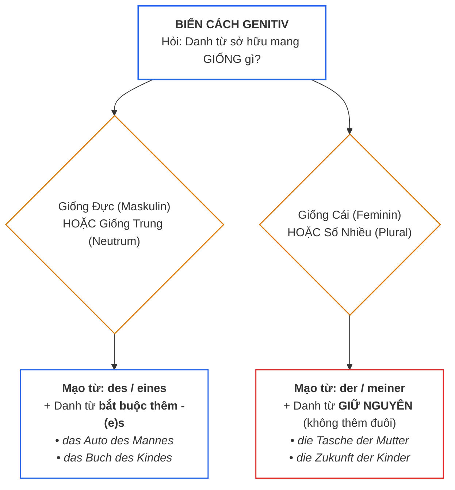
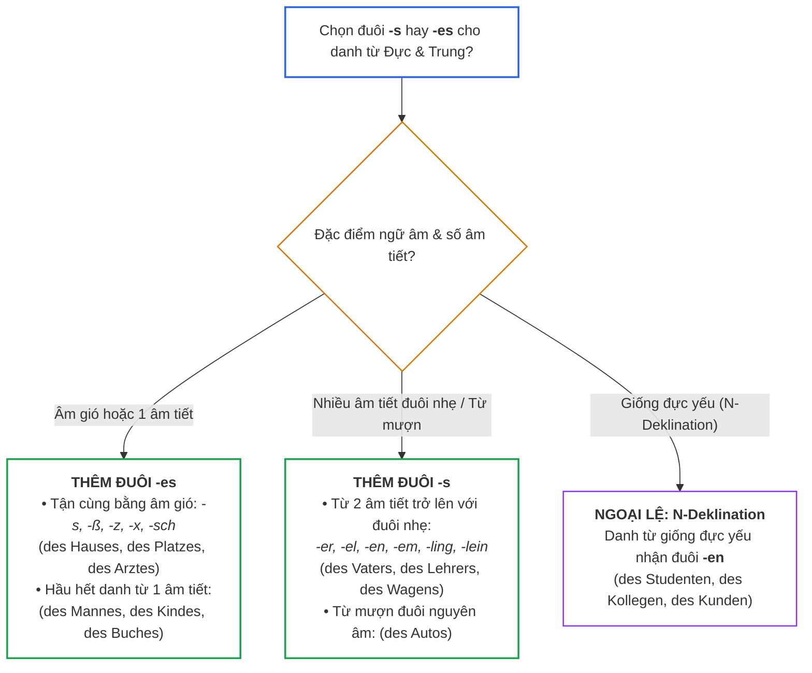
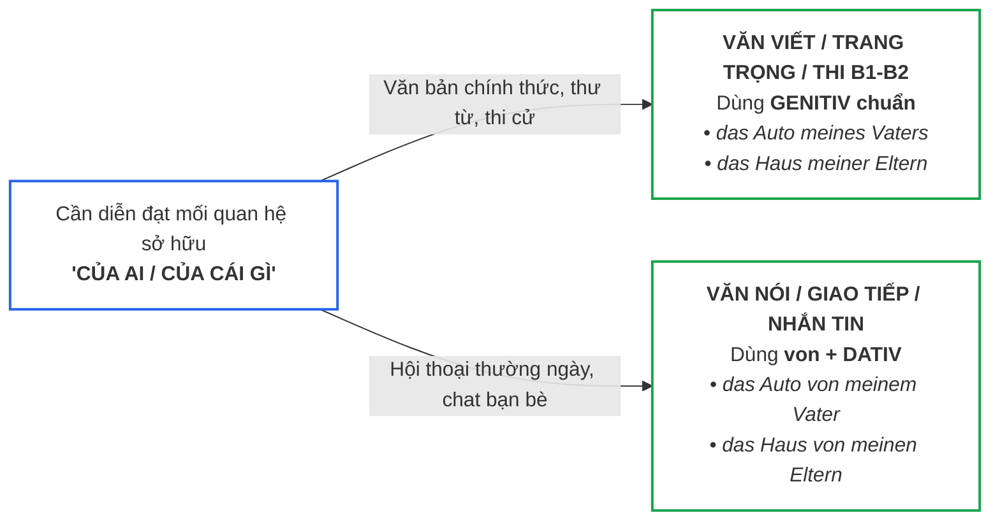

> [!info] Tổng quan
> **Der Genitiv (Sở hữu cách)** là cách thứ 4 trong tiếng Đức (sau *Nominativ, Akkusativ, Dativ*). Genitiv dùng để chỉ mối quan hệ sở hữu (*của ai, của cái gì*) và là tiêu chuẩn phân định giữa văn phong giao tiếp thông thường với văn phong trang trọng, chuẩn mực ở trình độ A2–B2.
> 
> Liên quan: [[02_Grammatik/01_A1/04_Der_Akkusativ|Akkusativ]] • [[02_Grammatik/01_A1/14_Akkusativ_und_Dativ_im_Vergleich__|Dativ]] • [[02_Grammatik/02_A2/11_Präpositionen_mit_Dativ_und_Akkusativ|Präpositionen]] • [[02_Grammatik/02_A2/13_Nominalisierung_Verben_als_Substantive__|Nominalisierung]] • [[99_Docs/01_Basisgrammatik|Basisgrammatik]]

---

## 1. Bản chất & Câu hỏi nhận diện

- **Bản chất:** Genitiv liên kết hai danh từ với nhau, trong đó danh từ đứng sau ở cách Genitiv bổ nghĩa cho danh từ đứng trước để chỉ **quyền sở hữu** hoặc **nguồn gốc thuộc về**.
- **Từ để hỏi:** **`Wessen?`** *(Của ai?)*.
  - *Frage:* **Wessen** Auto ist das? *(Đây là xe của ai?)*
  - *Antwort:* Das ist das Auto **des Lehrers**. *(Đó là xe của người thầy giáo).*

```text
[ Danh từ được sở hữu ]  +  [ Danh từ sở hữu ở cách GENITIV ]
       das Auto          +             des Vaters            = Chiếc xe của người bố
```

---

## 2. Bảng biến cách Mạo từ trong Genitiv

Bản đồ tư duy phân định biến cách mạo từ và đuôi danh từ theo 2 nhóm giống:



### 2.1. Bảng đối chiếu chi tiết

| Giống danh từ | Mạo từ xác định | Mạo từ không xác định / Phủ định | Quy tắc với đuôi danh từ | Ví dụ chuẩn |
| :--- | :--- | :--- | :--- | :--- |
| **Maskulin**<br>*(Giống đực - 🔵)* | **`des`** | **`eines / meines / keines`** | **Thêm `-(e)s`** vào danh từ | *das Auto **des Mannes***<br>*die Tasche **meines Vaters*** |
| **Neutrum**<br>*(Giống trung - 🟢)* | **`des`** | **`eines / meines / keines`** | **Thêm `-(e)s`** vào danh từ | *das Buch **des Kindes***<br>*das Dach **eines Hauses*** |
| **Feminin**<br>*(Giống cái - 🔴)* | **`der`** | **`einer / meiner / keiner`** | **KHÔNG đổi đuôi** | *die Tasche **der Mutter***<br>*die Adresse **meiner Freundin*** |
| **Plural**<br>*(Số nhiều - 🟡)* | **`der`** | **`meiner / keiner / aller`** | **KHÔNG đổi đuôi** | *die Zukunft **der Kinder***<br>*die Meinung **meiner Eltern*** |

> [!tip] Thần chú ghi nhớ đuôi mạo từ Genitiv: **S – R – S – R**
> - Đực: **`des`** (`-s`)
> - Cái: **`der`** (`-r`)
> - Trung: **`des`** (`-s`)
> - Số nhiều: **`der`** (`-r`)

---

## 3. Quy tắc thêm đuôi „-(e)s“ cho danh từ Giống Đực & Trung

Chỉ danh từ giống Đực (*Maskulin*) và giống Trung (*Neutrum*) mới nhận đuôi. Cây quyết định dưới đây giúp bạn xác định chính xác đuôi cần thêm:



### 3.1. Khi nào thêm `-s`?
Thêm `-s` khi danh từ có **từ 2 âm tiết trở lên**, đặc biệt là các đuôi nhẹ:
- Đuôi **`-er, -el, -en, -em, -ling, -lein`**: *des Vaters, des Lehrers, des Bruders, des Wagens, des Schülers*.
- Danh từ mượn tận cùng bằng nguyên âm: *des Autos, des Kinos, des Sofas*.

### 3.2. Khi nào thêm `-es`?
Thêm `-es` trong 2 trường hợp bắt buộc:
1. **Danh từ tận cùng bằng âm gió (`-s, -ß, -z, -tz, -x, -sch`):** Bắt buộc phải có `-es` để phát âm được:
   - *das Haus* $\rightarrow$ **des Hauses**
   - *der Platz* $\rightarrow$ **des Platzes**
   - *der Arzt* $\rightarrow$ **des Arztes**
   - *der Tisch* $\rightarrow$ **des Tisches**
2. **Hầu hết danh từ 1 âm tiết:** Thêm `-es` để đọc rõ ràng và tự nhiên hơn:
   - *der Mann* $\rightarrow$ **des Mannes**
   - *das Kind* $\rightarrow$ **des Kindes**
   - *das Buch* $\rightarrow$ **des Buches**
   - *das Jahr* $\rightarrow$ **des Jahres**

> [!caution] Ngoại lệ: Danh từ giống đực yếu (N-Deklination)
> Một số danh từ giống đực chỉ người (như *der Student, der Kollege, der Kunde, der Herr, der Nachbar*) khi sang Genitiv **KHÔNG thêm `-s`** mà nhận đuôi **`-en` / `-n`**:
> - *das Zimmer **des Studenten*** (không phải *des Students*)
> - *die E-Mail **des Kollegen*** (không phải *des Kolleges*)

---

## 4. Sở hữu với Tên riêng (Eigennamen)

Khi chỉ sở hữu của một người có tên cụ thể, tiếng Đức có quy tắc khác biệt rõ rệt so với tiếng Anh:

1. **Quy tắc cơ bản: Thêm `-s` trực tiếp vào tên, KHÔNG DÙNG DẤU NHÁY ĐƠN (`'`):**
   - Tiếng Đức: **`Peters Auto`** *(không viết: Peter's Auto)*.
   - Tiếng Đức: **`Annas Buch`** *(không viết: Anna's Buch)*.
2. **Tên tận cùng bằng âm gió (`-s, -z, -x, -ce`):** Chỉ thêm một **dấu nháy đơn `'` ở cuối tên**:
   - *Max* $\rightarrow$ **`Max' Fahrrad`**
   - *Lukas* $\rightarrow$ **`Lukas' Wohnung`**
   - *Hans* $\rightarrow$ **`Hans' Handy`**

---

## 5. Thay thế Genitiv trong văn nói: Cấu trúc „von + Dativ“

Sơ đồ lựa chọn phong cách diễn đạt tùy theo ngữ cảnh thực tế:



| Ý muốn nói | Văn viết / Học thuật (Genitiv chuẩn) | Văn nói / Đời thường (`von + Dativ`) |
| :--- | :--- | :--- |
| Xe của bố tôi | *das Auto **meines Vaters*** | *das Auto **von meinem Vater*** |
| Ngôi nhà của cha mẹ tôi | *das Haus **meiner Eltern*** | *das Haus **von meinen Eltern*** |
| Tên của thành phố này | *der Name **dieser Stadt*** | *der Name **von dieser Stadt*** |

> [!important] Khi nào BẮT BUỘC phải dùng Genitiv?
> - Trong các bài thi chứng chỉ tiếng Đức phần viết (**Goethe / Telc B1 & B2 Schreiben**).
> - Trong báo chí, sách vở, văn bản hành chính, hợp đồng và thư từ trang trọng với đối tác hoặc cơ quan nhà nước.

---

## 6. Bốn giới từ Genitiv thông dụng nhất ở A2/B1

Bên cạnh chức năng sở hữu, Genitiv còn đi sau **4 giới từ cực kỳ phổ biến**:

| Giới từ | Ý nghĩa | Ví dụ thực tế |
| :--- | :--- | :--- |
| **`während`** | **Trong khi / trong suốt** *(thời gian)* | • * **Während des Unterrichts** darf man nicht essen.*<br>*(Trong suốt giờ học không được ăn).*<br>• * **Während der Reise** habe ich viel geschlafen.* |
| **`wegen`** | **Bởi vì / do** *(nguyên nhân)* | • * **Wegen des schlechten Wetters** bleiben wir zu Hause.*<br>*(Vì thời tiết xấu nên chúng tôi ở nhà).*<br>• * **Wegen der Verspätung** kam ich zu spät.* |
| **`trotz`** | **Mặc dù / bất chấp** | • * **Trotz des starken Regens** ging er spazieren.*<br>*(Bất chấp cơn mưa lớn, anh ấy vẫn đi dạo).*<br>• * **Trotz der Müdigkeit** arbeitete sie weiter.* |
| **`(an)statt`** | **Thay vì** | • *Er kaufte ein Fahrrad **statt eines Autos**.*<br>*(Anh ấy mua xe đạp thay vì mua ô tô).* |

---

## 7. Tóm tắt ghi nhớ trong 3 giây

1. **Công thức sở hữu:** `Danh từ 1 + [des / der + Danh từ 2]`.
2. **Thần chú mạo từ:** **S - R - S - R** (*des Nam, der Nữ, des Trung, der Số nhiều*).
3. **Đuôi danh từ:** Chỉ có **Nam & Trung** mới thêm **`-s`** hoặc **`-es`** (*des Vaters, des Hauses*).
4. **Tên riêng:** Thêm `-s` **không dấu nháy** (*Peters Buch*).
5. **Văn nói:** Có thể linh hoạt thay bằng **`von + Dativ`** (*das Buch von Peter*).
6. **Bốn giới từ vàng:** `während` *(trong khi)*, `wegen` *(vì)*, `trotz` *(mặc dù)*, `statt` *(thay vì)* đi với Genitiv.
