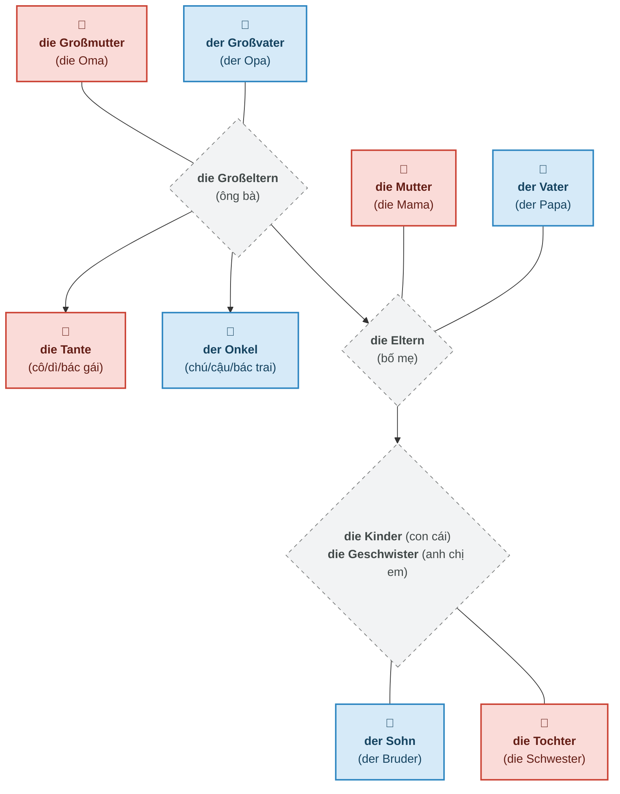
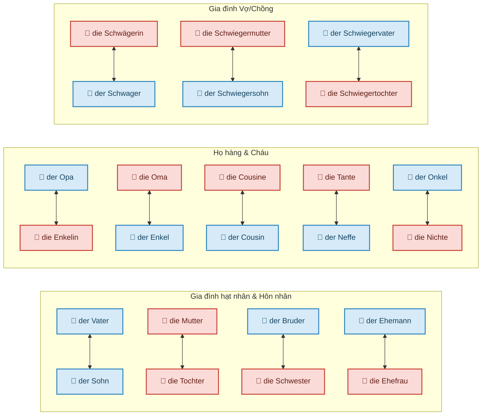

# Từ vựng chủ đề: Meine Familie (Gia đình của tôi)

Trong tiếng Đức, khi học danh từ bạn bắt buộc phải học kèm giống (der/die/das), dạng số nhiều và cách phát âm của chúng.
*(Lưu ý: Phần phát âm được ghi theo âm bồi tiếng Việt để người mới bắt đầu dễ hình dung nhất. Chữ "r" ở cuối từ thường được đọc nhẹ như âm "ờ").*

## I. Sơ đồ tư duy (Mindmap & Stammbaum)

### 1. Cây gia đình (Stammbaum)
Sơ đồ dưới đây giúp bạn dễ hình dung mối quan hệ trong gia đình qua các thế hệ. Màu xanh dương chỉ nam giới (der), màu đỏ hồng chỉ nữ giới (die).

### 2. Các cặp quan hệ đối xứng (Beziehungen)
Cách học từ vựng theo cặp (nam/nữ, cha/con...) sẽ giúp bạn ghi nhớ nhanh và lâu hơn!

## II. Bảng từ vựng chi tiết

### 1. Gia đình hạt nhân (Kernfamilie)
| Từ vựng (Số ít) | Phát âm | Số nhiều | Phát âm (Số nhiều) | Nghĩa Tiếng Việt |
| :--- | :--- | :--- | :--- | :--- |
| **die Familie** | *fa-mi-li-ờ* | die Familien | *fa-mi-li-ờn* | gia đình |
| *(chỉ có số nhiều)* | - | **die Eltern** | *el-tờn* | bố mẹ |
| **der Vater** | *fa-tờ* | die Väter | *fê-tờ* | bố |
| *(hay gọi:)* **der Papa** | *pa-pa* | die Papas | *pa-pa-x* | ba / bố |
| **die Mutter** | *mút-tờ* | die Mütter | *mứt-tờ* | mẹ |
| *(hay gọi:)* **die Mama** | *ma-ma* | die Mamas | *ma-ma-x* | má / mẹ |
| **das Kind** | *kin-t* | die Kinder | *kin-đờ* | đứa trẻ / con cái |
| **der Sohn** | *dôn* | die Söhne | *dơ-nờ* | con trai |
| **die Tochter** | *tóc-tờ* | die Töchter | *tớc-tờ* | con gái |
| *(chỉ có số nhiều)* | - | **die Geschwister**| *gê-suýt-x-tờ* | anh chị em ruột |
| **der Bruder** | *bru-đờ* | die Brüder | *bruy-đờ* | anh/em trai |
| **die Schwester** | *suét-x-tờ* | die Schwestern | *suét-x-tờn* | chị/em gái |

### 2. Quan hệ vợ chồng (Ehe)
| Từ vựng (Số ít) | Phát âm | Số nhiều | Phát âm (Số nhiều) | Nghĩa Tiếng Việt |
| :--- | :--- | :--- | :--- | :--- |
| **der Ehemann** | *ê-hờ-man* | die Ehemänner | *ê-hờ-men-nờ* | người chồng |
| **die Ehefrau** | *ê-hờ-phrau* | die Ehefrauen | *ê-hờ-phrau-ền* | người vợ |
| **der Partner** | *pát-nờ* | die Partner | *pát-nờ* | người bạn đời (nam) |
| **die Partnerin** | *pát-nờ-rin* | die Partnerinnen | *pát-nờ-rin-nền*| người bạn đời (nữ) |

### 3. Ông bà, họ hàng và các cháu (Großeltern, Verwandte & Enkelkinder)
| Từ vựng (Số ít) | Phát âm | Số nhiều | Phát âm (Số nhiều) | Nghĩa Tiếng Việt |
| :--- | :--- | :--- | :--- | :--- |
| *(chỉ có số nhiều)* | - | **die Großeltern** | *g-rốt-x-el-tờn* | ông bà |
| **der Großvater** | *g-rốt-x-fa-tờ* | die Großväter | *g-rốt-x-fê-tờ* | ông nội/ngoại |
| **die Großmutter**| *g-rốt-x-mút-tờ*| die Großmütter | *g-rốt-x-mứt-tờ* | bà nội/ngoại |
| *(hay gọi:)* **der Opa** | *ô-pa* | die Opas | *ô-pa-x* | ông |
| *(hay gọi:)* **die Oma** | *ô-ma* | die Omas | *ô-ma-x* | bà |
| **das Enkelkind** | *eng-kờl-kin-t*| die Enkelkinder | *eng-kờl-kin-đờ* | cháu (của ông bà) |
| **der Enkel** | *eng-kờl* | die Enkel | *eng-kờl* | cháu trai (của ông bà) |
| **die Enkelin** | *eng-kờ-lin* | die Enkelinnen | *eng-kờ-lin-nền*| cháu gái (của ông bà) |
| **der Onkel** | *ong-kờl* | die Onkel | *ong-kờl* | chú / bác / cậu trai |
| **die Tante** | *tan-tờ* | die Tanten | *tan-tờn* | cô / dì / mợ gái |
| **der Neffe** | *nef-phờ* | die Neffen | *nef-phờn* | cháu trai (của cô/chú/bác) |
| **die Nichte** | *ních-tờ* | die Nichten | *ních-tờn* | cháu gái (của cô/chú/bác) |
| **der Cousin** | *cu-dăng* | die Cousins | *cu-dăng-x* | anh / em họ (nam) |
| **die Cousine** | *cu-di-nờ* | die Cousinen | *cu-di-nền* | chị / em họ (nữ) |

### 4. Gia đình chồng/vợ và sui gia (Schwiegerfamilie)
| Từ vựng (Số ít) | Phát âm | Số nhiều | Phát âm (Số nhiều) | Nghĩa Tiếng Việt |
| :--- | :--- | :--- | :--- | :--- |
| *(chỉ có số nhiều)* | - | **die Schwiegereltern** | *suy-gờ-el-tờn* | bố mẹ chồng/vợ |
| **der Schwiegervater**| *suy-gờ-fa-tờ*| die Schwiegerväter | *suy-gờ-fê-tờ* | bố chồng/vợ |
| **die Schwiegermutter**| *suy-gờ-mút-tờ*| die Schwiegermütter| *suy-gờ-mứt-tờ* | mẹ chồng/vợ |
| **der Schwiegersohn** | *suy-gờ-dôn* | die Schwiegersöhne | *suy-gờ-dơ-nờ* | con rể |
| **die Schwiegertochter**| *suy-gờ-tóc-tờ*| die Schwiegertöchter| *suy-gờ-tớc-tờ* | con dâu |
| **der Schwager** | *soa-gờ* | die Schwäger | *suê-gờ* | anh/em rể, anh/em vợ |
| **die Schwägerin** | *suê-gờ-rin* | die Schwägerinnen| *suê-gờ-rin-nền*| chị/em dâu, chị/em vợ |

### 5. Tình trạng hôn nhân (Familienstand) - Tính từ
*  **ledig** (*lê-đích*): độc thân
*  **verheiratet** (*phe-hai-ra-tẹt*): đã kết hôn
*  **geschieden** (*gê-si-đền*): đã ly hôn
*  **verwitwet** (*phe-vít-vẹt*): góa (chồng/vợ)
* **Familienstand**:Tình trạng hôn nhân
## III. Sách

**Bài tập 1.7a: Das ist meine Familie (Nghe và điền từ)**
*(Dựa trên hình ảnh bài tập cung cấp)*

Từ vựng: *Bruder | Frau | Mann | Schwägerin | Schwester | Schwiegervater | Sohn | Tochter | Vater*

**Đoạn hội thoại và đáp án:**
* **Akono:** „Das ist meine Familie. Meine Kinder sind mein **Sohn (1)** Tayo und meine **Tochter (2)** Joana. Meine Schwiegertochter heißt Michaela.“
* **Joana:** „Hier ist mein **Vater (3)** Akono. Und das sind mein **Bruder (4)** Tayo und meine Schwägerin Michaela.“
* **Michaela:** „Hier sind mein **Mann (5)** Tayo, meine **Schwägerin (6)** Joana und mein **Schwiegervater (7)** Akono.“
* **Tayo:** „Hier ist mein Schatz, meine **Frau (8)** Michaela. Das sind mein Vater Akono und meine **Schwester (9)** Joana.“

verheiratet
zwei Kinder
Deutsch