> [!INFO] **Tổng quan**
> Bản tra nhanh ngữ pháp tiếng Đức **A1 → A2**. Mỗi chủ điểm chỉ giữ bản chất, công thức, một ví dụ và một "bẫy" chính; nội dung chi tiết, IPA và bài tập nằm ở các bài học được liên kết cuối mỗi mục.

### 1. Câu cơ bản & Vị trí động từ

Động từ chia là "trái tim" của câu tiếng Đức — vị trí của nó đổi theo loại câu:

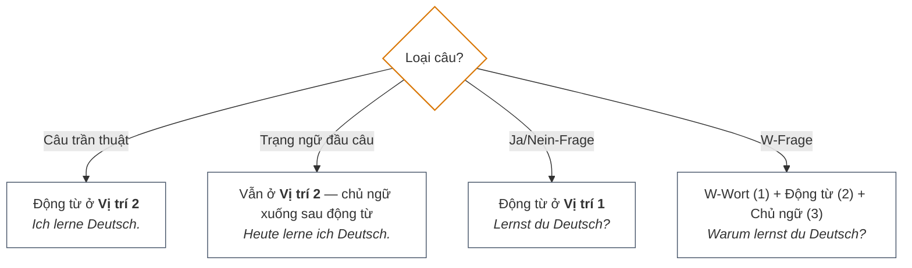

**Thứ tự trạng ngữ TeKaMoLo:**

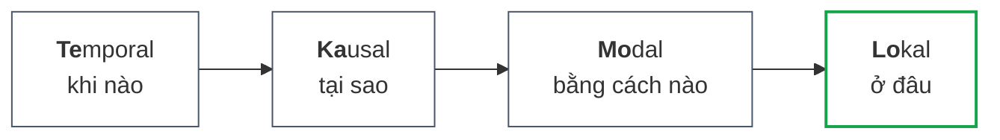

> [!TIP] *Ich fahre [morgen] [wegen des Regens] [mit dem Bus] [zur Arbeit].*

**Phủ định — chọn `kein` hay `nicht`?**

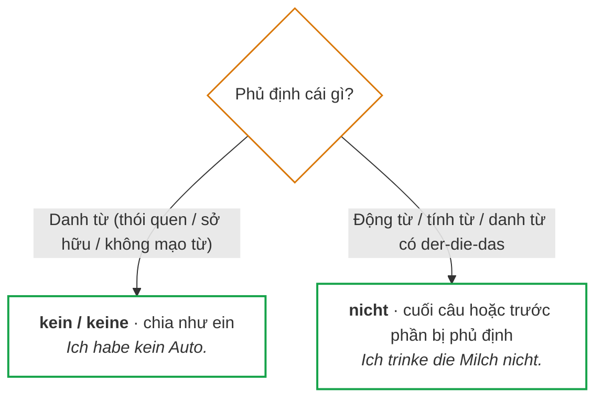

> [!CAUTION] **Một câu chỉ một phủ định:** ❌ *Ich habe nicht kein Auto.* — Trả lời câu hỏi phủ định khi thực tế ngược lại → dùng **`doch`**: *Kommst du nicht heute? → **Doch**, ich komme heute!*

**Chi tiết:** [[02_Grammatik/01_A1/03_Der_einfache_Satz_und_die_Verbposition|Câu & Vị trí động từ]] · [[02_Grammatik/01_A1/16_TE_KA_MO_LO__|TeKaMoLo]]

---

### 2. Giống danh từ & Số nhiều

Mọi danh từ đều có giống: `der` (đực) · `die` (cái) · `das` (trung). Nhận biết qua hậu tố — **chỉ là mẹo, không phải quy tắc 100%**:

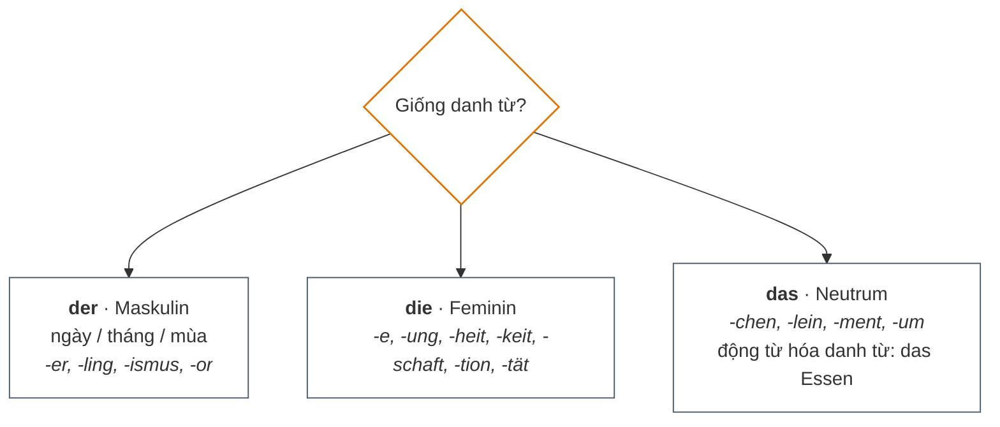

**Số nhiều luôn dùng `die`**, nhưng đuôi có 5 dạng — phải học theo cặp số ít / số nhiều:

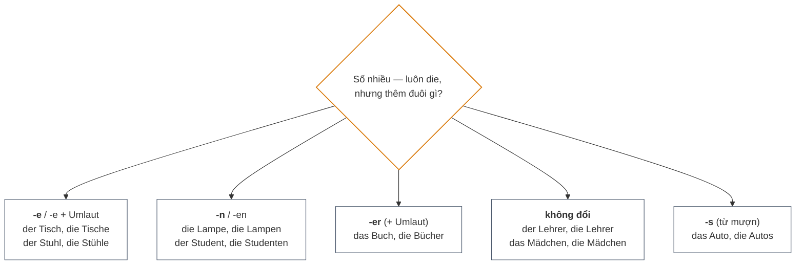

> [!CAUTION] **Bẫy Dativ số nhiều:** mạo từ `den` **và** danh từ đều thêm `-n` nếu danh từ chưa có `-n`: *mit den Kinder**n***, *in den Häuser**n***.

**Chi tiết:** [[02_Grammatik/01_A1/01_Nomen_und_Artikel|Nomen & Artikel]] · [[02_Grammatik/01_A1/15_Genus_der_Nomen__|Giống danh từ]] · [[02_Grammatik/01_A1/18_Merkhilfen_zum_Genus_der_Nomen__|Mẹo nhận biết giống]] · [[02_Grammatik/01_A1/02_Pluralformen_der_Nomen|Số nhiều]]

---

### 3. Biến cách: Nominativ – Akkusativ – Dativ

Chọn cách theo **câu hỏi đặt được cho danh từ đó**:

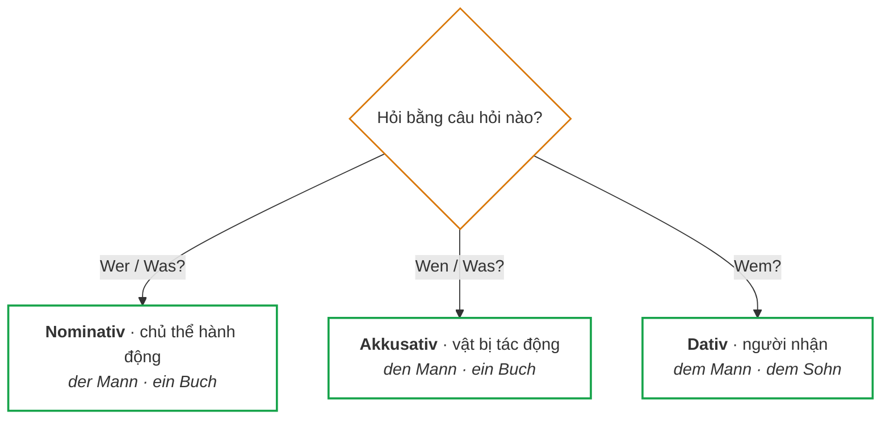

**Bảng mạo từ `der / ein / kein`:**

| Cách | Đực | Trung | Cái | Số nhiều |
| :--- | :--- | :--- | :--- | :--- |
| **Nominativ** | der / ein / kein | das / ein / kein | die / eine / keine | die / — / keine |
| **Akkusativ** | **den / einen / keinen** | das / ein / kein | die / eine / keine | die / — / keine |
| **Dativ** | **dem / einem / keinem** | **dem / einem / keinem** | **der / einer / keiner** | **den…+n** / — / **keinen…+n** |

> [!TIP] **Mẹo:** Akkusativ ("ĂN") chỉ giống đực đổi thành `-n`. Dativ nhớ **M-R-M-N** ("Mẹ Ra Mua Nước"): đực `-m`, cái `-r`, trung `-m`, số nhiều `-n`.

**Đại từ nhân xưng:**

| Ngôi | Nom | Akk | Dat |
| :--- | :--- | :--- | :--- |
| ich | ich | mich | mir |
| du | du | dich | dir |
| er / es | er / es | ihn / es | ihm / ihm |
| sie | sie | sie | ihr |
| wir | wir | uns | uns |
| ihr | ihr | euch | euch |
| sie / Sie | sie / Sie | sie / Sie | ihnen / Ihnen |

**Động từ luôn đi với Dativ** — bẫy kinh điển, không dùng Akkusativ:

| Động từ | Nghĩa | Ví dụ |
| :--- | :--- | :--- |
| helfen | giúp | Ich helfe **dem Mann**. |
| danken | cảm ơn | Ich danke **dir**. |
| gefallen | làm ai thích | Das Buch gefällt **mir**. |
| gehören | thuộc về | Das Auto gehört **meinem Vater**. |
| antworten | trả lời | Ich antworte **dem Lehrer**. |
| glauben | tin | Ich glaube **dir**. |

**Trật tự tân ngữ:**

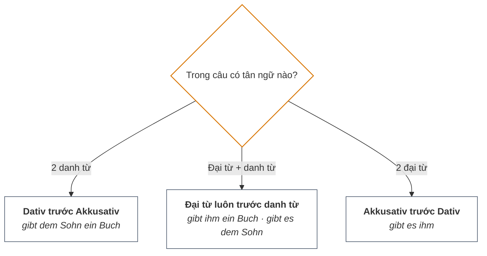

**Chi tiết:** [[02_Grammatik/01_A1/04_Der_Akkusativ|Akkusativ]] · [[02_Grammatik/01_A1/05_Der_Dativ|Dativ]] · [[02_Grammatik/01_A1/14_Akkusativ_und_Dativ_im_Vergleich__|So sánh Akk/Dat]] · [[02_Grammatik/01_A1/17_Personalpronomen_im_Akkusativ_und_Dativ__|Đại từ nhân xưng]]

---

### 4. Chia động từ ở thì hiện tại (Präsens)

Công thức: **bỏ đuôi `-en`, lấy thân động từ, thêm đuôi theo ngôi**.

> [!TIP] **Thần chú đuôi: E – ST – T – EN – T – EN** (ich, du, er/sie/es, wir, ihr, sie/Sie).

**3 nhóm cần chỉnh đuôi cho dễ phát âm:**

| Trường hợp | Chỉnh | Ví dụ |
| :--- | :--- | :--- |
| Thân kết thúc `-t, -d, -fn, -chn, -gn` | Thêm `-e-` ở du, er/sie/es, ihr | arbeiten: du arbeit**est**, er arbeit**et** |
| Thân kết thúc `-s, -ß, -z, -x` | du chỉ thêm `-t` | heißen: du heiß**t** |
| Đuôi `-eln, -ern` | ich bỏ `-e-`; wir/sie chỉ thêm `-n` | sammeln: ich **samml**e |

**Động từ mạnh** — đổi nguyên âm **chỉ ở `du` và `er/sie/es`**, các ngôi khác chia bình thường:

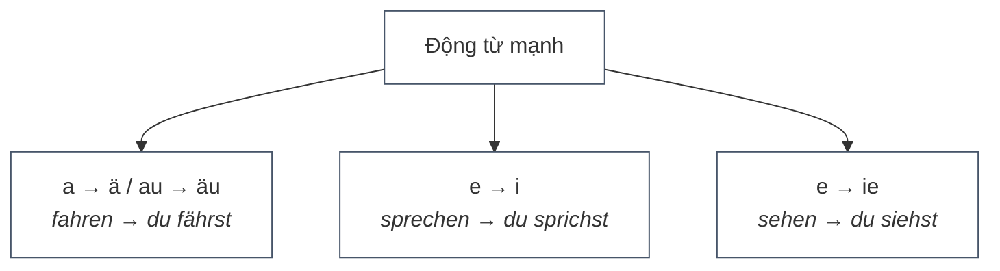

**4 động từ biến đổi hoàn toàn (bắt buộc thuộc lòng):**

| Ngôi | sein | haben | werden | wissen |
| :--- | :--- | :--- | :--- | :--- |
| ich | **bin** | habe | werde | **weiß** |
| du | **bist** | **hast** | **wirst** | **weißt** |
| er/sie/es | **ist** | **hat** | **wird** | **weiß** |
| wir | **sind** | haben | werden | wissen |
| ihr | **seid** | habt | werdet | wisst |
| sie/Sie | **sind** | haben | werden | wissen |

**Chi tiết:** [[02_Grammatik/01_A1/13_Verbkonjugation_im_Präsens__|Chia động từ]] · [[02_Grammatik/02_A2/12_Unregelmäßige_Verben__|Động từ bất quy tắc]]

---

### 5. Động từ tách (Trennbare Verben)

Động từ tách = **tiền tố + gốc**. Trong câu chính: gốc chia ở vị trí 2, tiền tố bị "đá" **xuống cuối câu**.

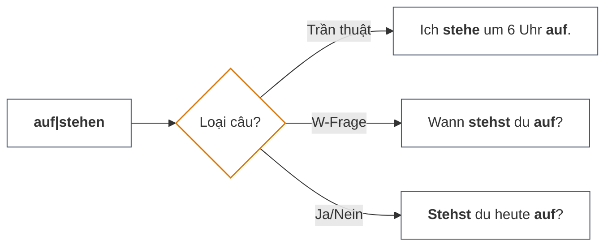

> [!TIP] **Phân loại tiền tố:**
> - **Tách:** `ab- an- auf- aus- ein- fern- mit- nach- vor- weg- zu-` → *ankommen, aufstehen, einkaufen*
> - **Không tách:** `be- ver- ent- emp- er- ge- miss- zer-` → *bekommen, verstehen, gefallen*
> - **Tùy từ:** `über- unter- durch-` → *über|setzen* = phiên dịch (tách); *über**sétzen*** = vượt qua (không tách)

> [!CAUTION] **Bẫy:** tiền tố luôn ở **cuối câu**, dù câu dài: *Wir **kaufen** am Wochenende im Supermarkt **ein**.* Trong Perfekt, `ge-` chèn **giữa**: *einkaufen → ein**ge**kauft* (nhưng *verstehen → verstanden*, không có `ge-`).

**Chi tiết:** [[02_Grammatik/01_A1/08_Trennbare_Verben|Động từ tách]]

---

### 6. Modalverben & Imperativ

**Modalverben** — động từ chính luôn ở **dạng nguyên thể, cuối câu**:

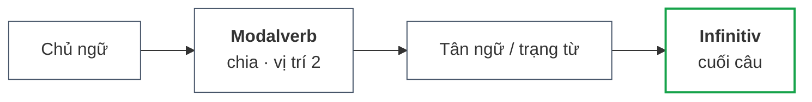

**Chọn modalverb theo ý muốn diễn đạt:**

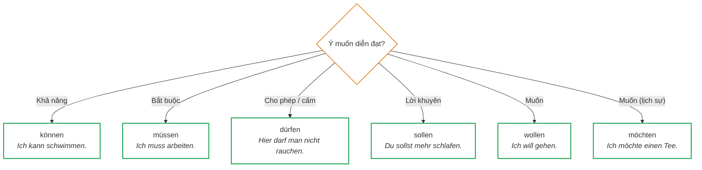

> [!TIP] **2 quy tắc vàng:** `ich = er/sie/es` và **không có đuôi** (*ich kann = er kann*). Số ít đổi nguyên âm: können→a, müssen→u, dürfen→a, wollen→i (sollen, möchten giữ nguyên).

| Ngôi | können | müssen | dürfen | wollen | sollen | möchten |
| :--- | :--- | :--- | :--- | :--- | :--- | :--- |
| ich | kann | muss | darf | will | soll | möchte |
| du | kannst | musst | darfst | willst | sollst | möchtest |
| er/sie/es | kann | muss | darf | will | soll | möchte |
| wir | können | müssen | dürfen | wollen | sollen | möchten |
| ihr | könnt | müsst | dürft | wollt | sollt | möchtet |
| sie/Sie | können | müssen | dürfen | wollen | sollen | möchten |

**Imperativ** — câu mệnh lệnh:

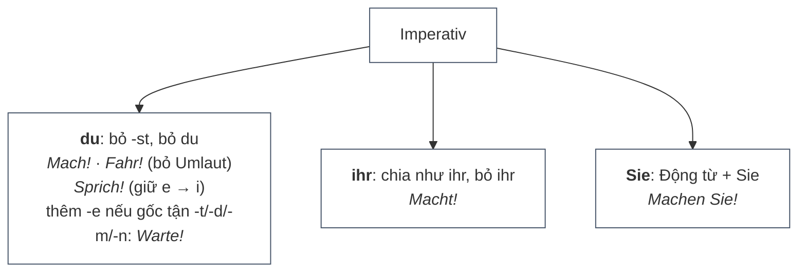

**Chi tiết:** [[02_Grammatik/01_A1/09_Modalverben|Modalverben]] · [[02_Grammatik/01_A1/11_Imperativsatz|Imperativ]]

---

### 7. Giới từ (Präpositionen)

**Luôn đi với Akkusativ (FUDOGBE):** `für, um, durch, ohne, gegen, bis, entlang` → *für **den** Vater, ohne Zucker.*

**Luôn đi với Dativ:** `mit, nach, aus, bei, von, zu, seit` → *mit **dem** Zug, nach **der** Arbeit.*

**Phân biệt `nach` / `zu` / `in` — 3 cách nói "đến":**

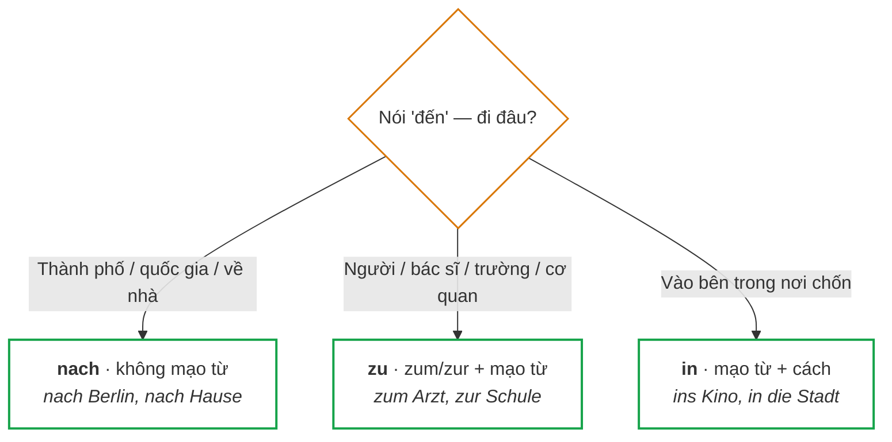

**Giới từ hai chiều** — chọn cách theo câu hỏi:

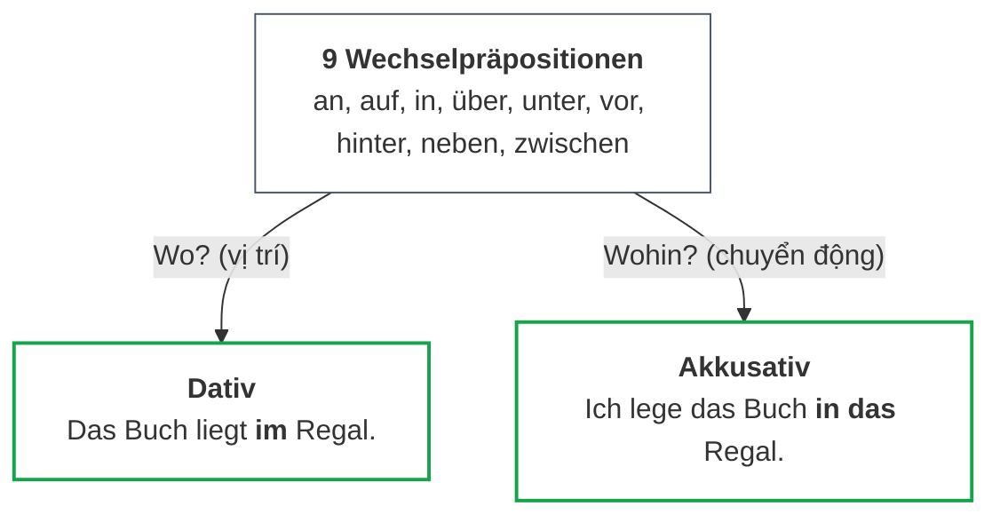

**Giới từ thời gian:**

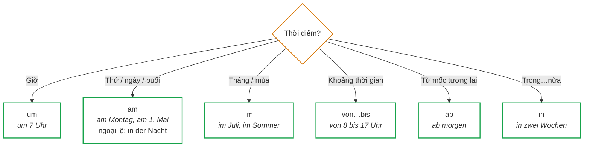

> [!CAUTION] **Bẫy:** học theo **câu hỏi**, không học máy móc theo động từ: *Ich gehe im Park spazieren* (Wo? → Dat) nhưng *Ich gehe in den Park* (Wohin? → Akk).

**Chi tiết:** [[02_Grammatik/01_A1/06_Lokale_Präpositionen|Giới từ nơi chốn]] · [[02_Grammatik/01_A1/07_Temporale_Präpositionen|Giới từ thời gian]]

---

### 8. Perfekt

Công thức: **Chủ ngữ + `haben`/`sein` (vị trí 2) + … + Partizip II (cuối câu)**.

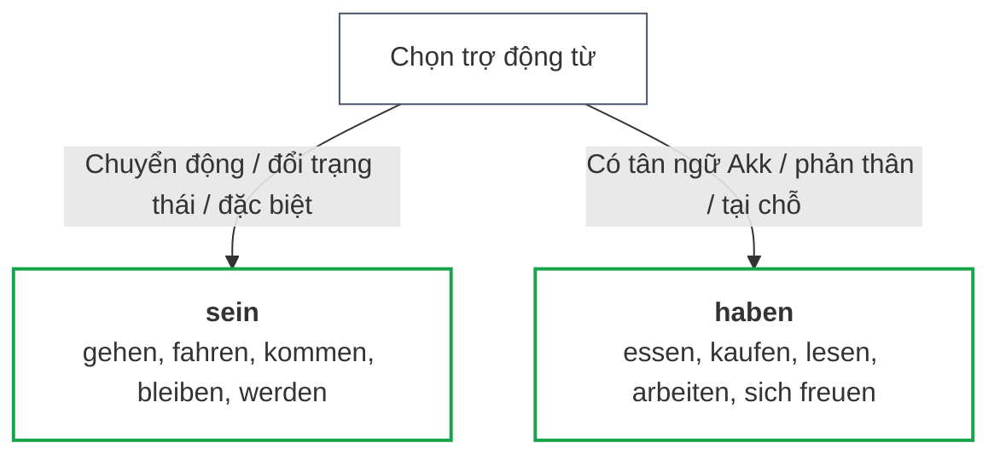

**Cách tạo Partizip II** — quyết định qua 2 bậc:

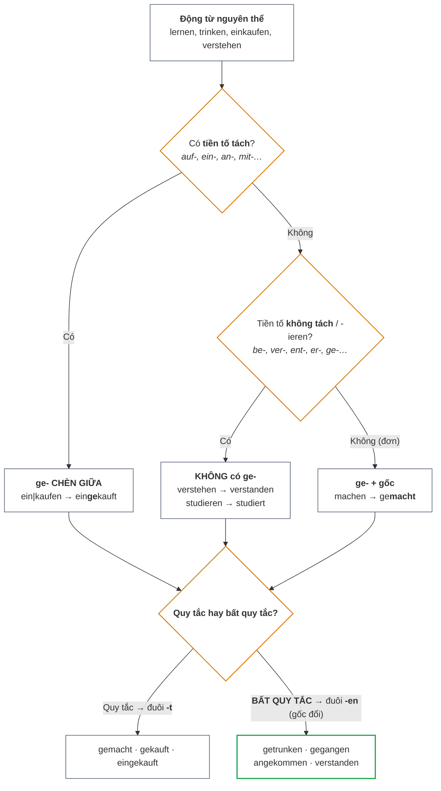

**Chi tiết:** [[02_Grammatik/01_A1/10_Perfekt|Perfekt]]

---
### 9. Sở hữu, phản thân & Động từ + giới từ

**Possessivartikel** chia như `ein/kein`. Gốc theo người sở hữu: mein- (tôi), dein- (bạn), sein- (anh ấy/nó), ihr- (cô ấy/họ), unser- (chúng tôi), euer- (các bạn), Ihr- (Ngài).

| Cách | Đực | Trung | Cái | Số nhiều |
| :--- | :--- | :--- | :--- | :--- |
| Nom | mein | mein | meine | meine |
| Akk | meinen | mein | meine | meine |
| Dat | meinem | meinem | meiner | meinen |

> [!CAUTION] `euer` rớt `-e-` khi thêm đuôi: *euer Hund* → *eu**re** Katze*.

**Reflexivverben** — đại từ phản thân:

| Ngôi | Akk | Dat |
| :--- | :--- | :--- |
| ich / du | mich / dich | mir / dir |
| er / sie / es | **sich** | **sich** |
| wir / ihr | uns / euch | uns / euch |
| sie / Sie | **sich** | **sich** |

**Chọn Akkusativ hay Dativ cho đại từ phản thân?**

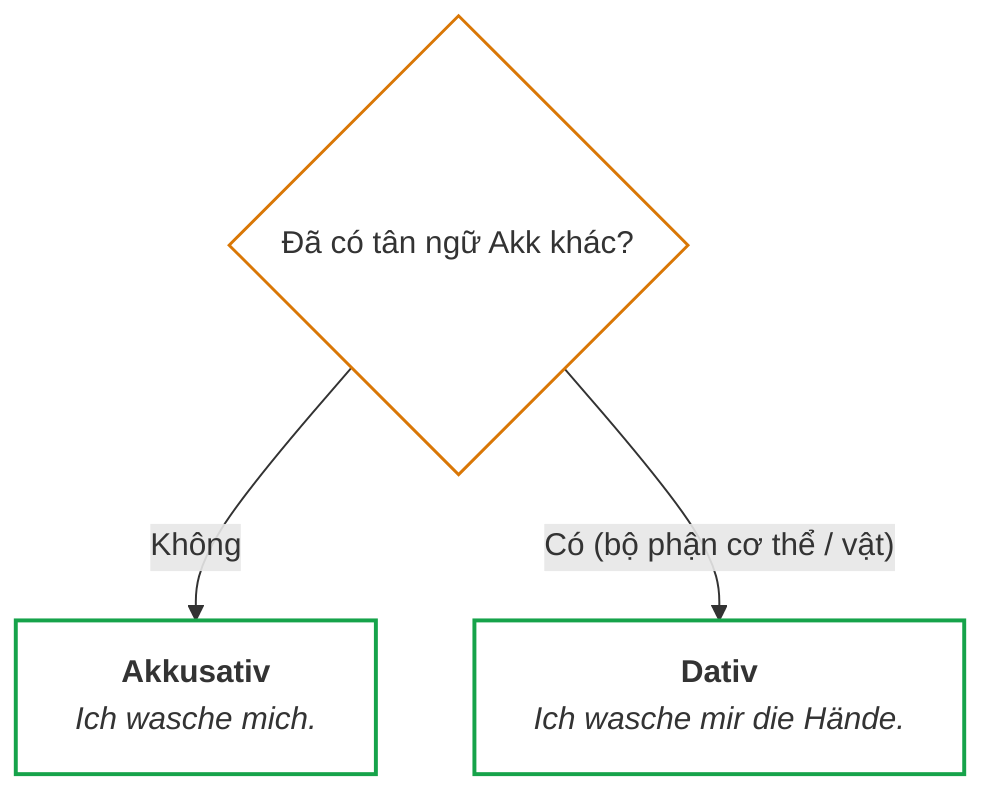

**Động từ + giới từ** — hỏi/trả lời phân biệt Người vs Vật:

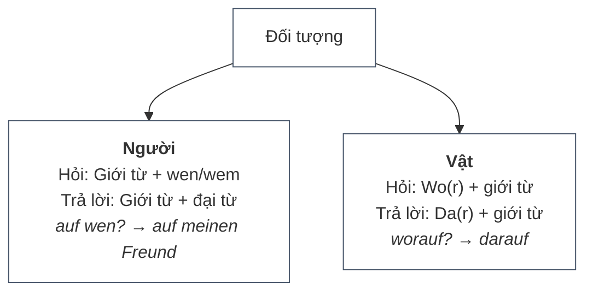

| Động từ + giới từ | Cách | Ví dụ |
| :--- | :--- | :--- |
| warten auf | Akk | Ich warte **auf den Bus / darauf**. |
| sich freuen auf / über | Akk | auf = mong (tương lai) · über = vui (đã xảy ra) |
| sich interessieren für | Akk | Er interessiert sich **für Musik**. |
| denken an | Akk | Ich denke **an dich**. |
| sprechen mit / über | Dat / Akk | mit dem Chef · über das Projekt |
| träumen von | Dat | Sie träumt **von einem Haus**. |

**Chi tiết:** [[02_Grammatik/02_A2/01_Possessivartikel|Sở hữu]] · [[02_Grammatik/02_A2/03_Reflexive_Verben_und_Reflexivpronomen|Phản thân]] · [[02_Grammatik/02_A2/02_Verben_mit_Präpositionen|Động từ + giới từ]]

---

### 10. Präteritum, Mệnh đề phụ & Liên từ

**Präteritum** — ưu tiên cho `sein`, `haben`, Modalverben trong kể chuyện / văn viết:

| Ngôi | sein | haben | können | müssen |
| :--- | :--- | :--- | :--- | :--- |
| ich | war | hatte | konnte | musste |
| du | warst | hattest | konntest | musstest |
| er/sie/es | war | hatte | konnte | musste |
| wir | waren | hatten | konnten | mussten |
| ihr | wart | hattet | konntet | musstet |
| sie/Sie | waren | hatten | konnten | mussten |

**Nebensatz** — liên từ phụ thuộc kéo động từ chia **xuống cuối**:

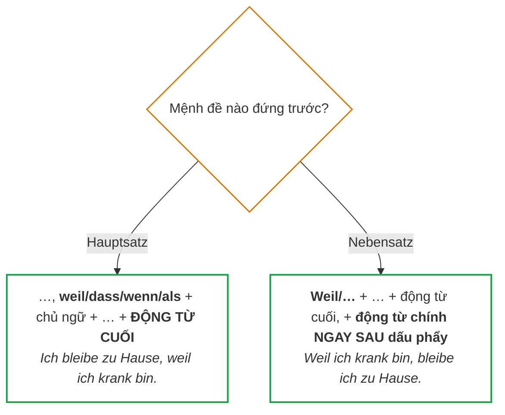

| Liên từ | Dùng | Ví dụ |
| :--- | :--- | :--- |
| weil | nguyên nhân | …weil ich in Deutschland arbeiten **möchte**. |
| dass | "rằng" sau sagen/denken/wissen | Er sagt, dass er morgen **kommt**. |
| wenn | khi/nếu (hiện tại/tương lai, lặp lại) | **Wenn** es regnet, **bleibe** ich zu Hause. |
| als | khi (1 lần trong quá khứ) | **Als** ich 10 war, **lebte** ich auf dem Land. |

**Liên từ nối 2 câu chính:**

```mermaid
flowchart TD
    classDef node fill:transparent,stroke:#475569,stroke-width:1px;
    C["Liên từ"] --> ADUSO["<span style='font-weight:bold'>Vị trí 0</span> · không đảo<br>aber, denn, und, sondern, oder<br><span style='font-style:italic'>…, aber ich habe gelernt.</span>"]
    C --> ADV["<span style='font-weight:bold'>Vị trí 1</span> · đảo ngữ<br>deshalb, trotzdem, dann, sonst<br><span style='font-style:italic'>…, deshalb gehe ich zum Arzt.</span>"]
    class C,ADUSO,ADV node;
```

> [!CAUTION] **denn vs weil:** `denn` không đảo, động từ vị trí 2 (*denn ich bin müde*); `weil` kéo động từ về cuối (*weil ich müde bin*).

**Chi tiết:** [[02_Grammatik/02_A2/04_Präteritum_Sein_Haben_und_Modalverben|Präteritum]] · [[02_Grammatik/02_A2/05_Nebensatz_Weil_Dass_Wenn_Als|Mệnh đề phụ]] · [[02_Grammatik/02_A2/06_Satzstellung_mit_Hauptsatzverbindungen|Liên từ nối câu chính]]

---

### 11. Chia đuôi tính từ & So sánh

Tính từ đứng trước danh từ phải thêm đuôi — chọn đuôi theo mạo từ đứng trước:

```mermaid
flowchart TD
    classDef node fill:transparent,stroke:#475569,stroke-width:1px;
    classDef decision fill:transparent,stroke:#d97706,stroke-width:1.5px;
    classDef result fill:transparent,stroke:#16a34a,stroke-width:2px;
    ADJ["Tính từ trong câu"] --> Q1{"Đứng ngay trước danh từ?"}
    Q1 -->|"Không (sau sein / werden / bleiben)"| PRED["<span style='font-weight:bold'>NGUYÊN MẪU — không đuôi</span><br><span style='font-style:italic'>Der Hund ist klein.</span>"]
    Q1 -->|"Có"| Q2{"Cái gì đứng ngay trước tính từ?"}
    Q2 -->|"der / die / das<br>(mạo từ xác định)"| W["<span style='font-weight:bold'>CHIA YẾU</span><br>• Nom Sg (M/F/N) & Akk Sg (F/N): <span style='font-weight:bold'>-e</span><br>• Còn lại (Akk M, mọi Dativ, mọi Plural): <span style='font-weight:bold'>-en</span><br><span style='font-style:italic'>der alte Mann · die schöne Frau · den alten Mann · die alten Bücher</span>"]
    Q2 -->|"ein / mein / kein / Ihr...<br>(mạo từ không xác định / sở hữu)"| M["<span style='font-weight:bold'>CHIA HỖN HỢP</span><br>• Nom Sg: M <span style='font-weight:bold'>-er</span> · F <span style='font-weight:bold'>-e</span> · N <span style='font-weight:bold'>-es</span><br>• Akk Sg: M <span style='font-weight:bold'>-en</span> · F <span style='font-weight:bold'>-e</span> · N <span style='font-weight:bold'>-es</span><br>• Mọi Dativ & mọi Plural (keine/meine): <span style='font-weight:bold'>-en</span><br><span style='font-style:italic'>ein alter Mann · eine wichtige Prüfung · mit einem neuen Auto</span>"]
    Q2 -->|"không mạo từ"| S["<span style='font-weight:bold'>CHIA MẠNH</span> (tính từ lấy đuôi der/die/das)<br>• Nom: M <span style='font-weight:bold'>-er</span> · F <span style='font-weight:bold'>-e</span> · N <span style='font-weight:bold'>-es</span> · Pl <span style='font-weight:bold'>-e</span><br>• Akk: M <span style='font-weight:bold'>-en</span> · F <span style='font-weight:bold'>-e</span> · N <span style='font-weight:bold'>-es</span> · Pl <span style='font-weight:bold'>-e</span><br>• Dat: M/N <span style='font-weight:bold'>-em</span> · F <span style='font-weight:bold'>-er</span> · Pl <span style='font-weight:bold'>-en</span><br><span style='font-style:italic'>kalter Tee · frische Milch · mit gutem Wein</span>"]
    class Q1,Q2 decision;
    class ADJ,W,M,S node;
    class PRED result;
```

**Bảng tra nhanh đuôi tính từ (Nominativ – Akkusativ – Dativ):**

| Cách | Giống | Sau mạo từ xác định<br>(*der / die / das*) | Sau mạo từ không xác định<br>(*ein / mein / kein...*) | Không mạo từ<br>(*ohne Artikel*) |
| :--- | :--- | :--- | :--- | :--- |
| **Nominativ** | Đực (M)<br>Cái (F)<br>Trung (N)<br>Số nhiều (Pl) | der alt**e**<br>die klein**e**<br>das neu**e**<br>die alt**en** | ein alt**er**<br>eine klein**e**<br>ein neu**es**<br>keine alt**en** | alt**er**<br>klein**e**<br>neu**es**<br>alt**e** |
| **Akkusativ** | Đực (M)<br>Cái (F)<br>Trung (N)<br>Số nhiều (Pl) | den alt**en**<br>die klein**e**<br>das neu**e**<br>die alt**en** | einen alt**en**<br>eine klein**e**<br>ein neu**es**<br>keine alt**en** | alt**en**<br>klein**e**<br>neu**es**<br>alt**e** |
| **Dativ** | Đực (M)<br>Cái (F)<br>Trung (N)<br>Số nhiều (Pl) | dem alt**en**<br>der klein**en**<br>dem neu**en**<br>den alt**en** (+n) | einem alt**en**<br>einer klein**en**<br>einem neu**en**<br>keinen alt**en** (+n) | alt**em**<br>klein**er**<br>neu**em**<br>alt**en** (+n) |

> [!TIP] **Tính từ đứng sau động từ thì KHÔNG chia đuôi** (không kèm danh từ): *Der Hund ist klein. · Das Auto ist neu.*

> [!TIP] **2 luật vàng (Nominativ/Akkusativ):** Akkusativ **Maskulin → luôn `-en`** bất kể mạo từ (*einen freien Vormittag*, *jeden Tag*, *nächsten Montag*); Nominativ/Akkusativ **Feminin → luôn `-e`** bất kể mạo từ (*eine kurze Rückmeldung*, *nächste Woche*). Chỉ Neutrum trần (`ein`) mới cần `-es`.

> [!TIP] **Mẹo:** mạo từ càng "mạnh" thì tính từ càng "yếu". `der` đã cho biết giống → tính từ chỉ cần `-e`/`-en`; `ein` thiếu thông tin → tính từ phải gánh đuôi `-er/-es`.

**So sánh:**

| Kiểu | Công thức | Ví dụ |
| :--- | :--- | :--- |
| Bằng | `so + Adj + wie` | so groß **wie** du |
| Hơn | `Adj + -er + als` | schneller **als** das Fahrrad |
| Nhất | `am + Adj + -sten` | **am** höchst**en** |

| Bất quy tắc | Komparativ | Superlativ |
| :--- | :--- | :--- |
| gut | besser | am besten |
| viel | mehr | am meisten |
| gern | lieber | am liebsten |
| hoch | höher | am höchsten |
| nah | näher | am nächsten |

> [!CAUTION] **Có danh từ theo sau thì phải chia đuôi:** *der größ**ere** Mann*, *das best**e** Bild* — và **không dùng `am`** trước danh từ: ❌ *am beste Freund* → ✅ *der beste Freund*.

**Chi tiết:** [[02_Grammatik/02_A2/08_Adjektivendungen|Chia đuôi tính từ]] · [[02_Grammatik/02_A2/09_Komparativ_und_Superlativ|So sánh]] · [[02_Grammatik/02_A2/10_Adjektivendungen_im_Komparativ_und_Superlativ|So sánh + chia đuôi]]

---

### 12. Konjunktiv II & Nominalisierung

**Konjunktiv II** — giả định, mong muốn, lịch sự:

| Động từ | ich | du | er/sie/es | wir | ihr | sie/Sie |
| :--- | :--- | :--- | :--- | :--- | :--- | :--- |
| würde + Infinitiv | würde | würdest | würde | würden | würdet | würden |
| haben → hätte | hätte | hättest | hätte | hätten | hättet | hätten |
| sein → wäre | wäre | wärst | wäre | wären | wärt | wären |
| können → könnte | könnte | könntest | könnte | könnten | könntet | könnten |

**3 cách dùng chính:**

```mermaid
flowchart TD
    classDef node fill:transparent,stroke:#475569,stroke-width:1px;
    classDef decision fill:transparent,stroke:#d97706,stroke-width:1.5px;
    classDef result fill:transparent,stroke:#16a34a,stroke-width:2px;
    K{"Mục đích nói?"}
    K -->|"Yêu cầu lịch sự"| P["<span style='font-style:italic'>Könnten Sie mir helfen?</span>"]
    K -->|"Ước muốn"| W["<span style='font-style:italic'>Ich hätte gern einen Tee.</span>"]
    K -->|"Lời khuyên"| A["<span style='font-style:italic'>Du solltest mehr schlafen.</span>"]
    class K decision;
    class P,W,A result;
```

**Nominalisierung** — biến động từ thành danh từ: **viết hoa nguyên thể + `das`**:

```mermaid
flowchart LR
    classDef node fill:transparent,stroke:#475569,stroke-width:1px;
    classDef result fill:transparent,stroke:#16a34a,stroke-width:2px;
    V["lesen"] --> N["<span style='font-weight:bold'>das Lesen</span><br>việc đọc"] --> E["Dùng như danh từ thường<br>chủ ngữ / tân ngữ / sau giới từ"]
    class V,E node;
    class N result;
```

*Das Lesen hilft mir. · Ich hasse **das Warten**. · Beim (bei dem) Autofahren darf man nicht telefonieren.*

> [!TIP] Chỉ số ít, không có số nhiều: ✅ *das Lesen* · ❌ *die Lesen*.

**Chi tiết:** [[02_Grammatik/02_A2/07_Konjunktiv_II|Konjunktiv II]] · [[02_Grammatik/02_A2/13_Nominalisierung_Verben_als_Substantive__|Nominalisierung]]
